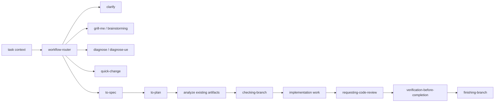

# Skills

lihuanyu 个人的 Codex skill 仓库，用于沉淀、维护和迭代可复用 workflow skills。

## 核心链路



workflow skills 使用 `Natural Handoff` 做自然交接：一个 skill 完成后最多推荐一个 next skill，并用 1-3 句说明结果、推荐下一步和理由。用户回复 `继续`、`可以`、`按你说的办`、`go ahead`、`ok` 或 `好的` 时，只会进入上一条回复中唯一推荐的 next skill；如果上一条给了多个选项，或用户确认时改变条件，必须重新路由。

`Natural Handoff` 只负责 skill 之间的转场，不会绕过目标 skill 的内部安全门。实现类、分支类、提交类或文档写入类 skill 仍然必须处理自己的 scope、branch、verification、review、commit、push 或修改计划确认。

## Skills

| Skill | 用途 |
| --- | --- |
| `clarify` | 源码解释、调用链、图表和报告；只回答问题，不推荐后续 skill |
| `brainstorming` | 设计前澄清目标、比较方案并准备 `$to-spec` 交接内容 |
| `grill-me` | 追问方案、约束、风险和验收 |
| `quick-change` | 处理小型 bug、小需求和低风险快速改动 |
| `to-spec` | 将方向共识沉淀成叙事型 spec 和需求契约 |
| `to-plan` | 将 spec 拆成带接口契约和验证命令的任务级 plan |
| `analyze` | 只读检查 spec/plan 一致性、覆盖率和接口契约 |
| `checking-branch` | 展示当前分支状态，确认直接修改或创建新分支 |
| `tdd` | 按 RED/GREEN/REFACTOR 循环推进测试先行实现 |
| `implement` | 按 TDD、review 和 verification 执行实现 |
| `diagnose` | 执行通用 bug / 性能回归诊断，产出 root cause 和修复入口建议 |
| `diagnose-ue` | 执行 Unreal Engine 问题诊断，产出 UE 运行形态、root cause 和修复入口建议 |
| `improve-codebase-architecture` | 架构加深、重构机会和 testability 改进 |
| `requesting-code-review` | 两阶段实现评审 |
| `verification-before-completion` | 完成前验证质量门 |
| `finishing-branch` | 开发分支收尾和交付选项 |
| `handoff` | 生成跨会话交接文档，方便下一位 agent 接手 |
| `session-curator` | 会话结束后手动提炼通用经验，确认计划后同步项目文档、agent 规则和记忆 |

## 开发原则

- 主要语言使用中文。
- Skill 结构要求、文件名、目录名、YAML frontmatter key、配置字段、命令、代码、API 名称、英文专业术语和英文专有名词保留英文。
- Skill 生成的 Markdown/HTML 文档、分析结论、review、handoff、完成报告和聊天式输出默认中文为主；代码、命令、API 名称、contract fields、稳定 ID、英文专有名词和必要技术术语保留 English。
- 用户明确要求英文，或目标项目已有英文 artifact 规范时可以例外，但必须记录原因。
- 产出型 skill 使用统一 `Language Contract` 标记；核心 section heading 使用中文优先、English 括注。
- 新增或修改 skill 时，明确 pressure scenarios、trigger description 和 metadata，再运行本地 validator。
- workflow skill 完成后通过 `Natural Handoff` 最多推荐一个 next skill；自然确认只绑定上一条唯一推荐，不能跨过目标 skill 的内部安全门。
- `clarify` 是只读解释路径，完成后自然结束，不推荐后续 skill。
- `grill-me`、`brainstorming`、`diagnose` 和 `diagnose-ue` 不直接写业务代码；需要进入修复或实现时，通过 `Natural Handoff` 推荐 `$quick-change` 或 `$implement`。
- 小、清楚、低风险且可快速验证的 feature 或 bug fix 可走 `$quick-change`；跨模块、需求不清、影响 contract、多 task 或验收复杂的变更走 `$to-spec -> $to-plan -> $analyze -> $implement`。

## 验证

```powershell
python scripts/validate-skills.py
```
