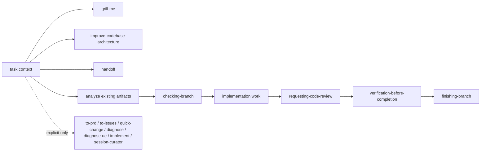

# Skills

lihuanyu 个人的 Codex skill 仓库，用于沉淀、维护和迭代可复用 workflow skills。

## 核心链路



`to-prd`、`to-issues`、`quick-change`、`diagnose`、`diagnose-ue`、`implement` 和 `session-curator` 都是用户手动触发的 skill，不在默认路由或实现链路中自动运行。

## Skills

| Skill | 用途 |
| --- | --- |
| `clarify` | 源码解释、调用链、图表和报告 |
| `grill-me` | 追问方案、约束、风险和验收 |
| `quick-change` | 手动调用后处理小型 bug、小需求和低风险快速改动 |
| `to-prd` | 手动调用后将上下文整理成本地 PRD |
| `to-issues` | 手动调用后将 PRD/plan/spec 拆成本地 issues |
| `analyze` | 只读检查 artifacts 一致性和覆盖率 |
| `checking-branch` | 展示当前分支状态，确认直接修改或创建新分支 |
| `implement` | 手动调用后按 TDD 执行实现 |
| `diagnose` | 手动调用后执行通用 bug / 性能回归诊断 |
| `diagnose-ue` | 手动调用后执行 Unreal Engine 问题诊断 |
| `improve-codebase-architecture` | 架构加深、重构机会和 testability 改进 |
| `requesting-code-review` | 两阶段实现评审 |
| `verification-before-completion` | 完成前验证质量门 |
| `finishing-branch` | 开发分支收尾和交付选项 |
| `handoff` | 生成跨会话交接文档，方便下一位 agent 接手 |
| `session-curator` | 会话结束后手动提炼通用经验，确认计划后同步项目文档、agent 规则和记忆 |

## 开发原则

- 主要语言使用中文。
- Skill 结构要求、文件名、目录名、YAML frontmatter key、配置字段、命令、代码、API 名称、英文专业术语和英文专有名词保留英文。
- Skill 生成的 Markdown/HTML 文档、分析结论、review、handoff、完成报告和聊天式输出默认中文为主；代码、命令、API 名称、contract fields、稳定 ID、英文专有名词和必要技术术语保留 English。
- 用户明确要求英文，或目标项目已有英文 artifact 规范时可以例外，但必须记录原因。
- 产出型 skill 使用统一 `Language Contract` 标记；核心 section heading 使用中文优先、English 括注。
- 新增或修改 skill 时，明确 pressure scenarios、trigger description 和 metadata，再运行本地 validator。
- `to-prd`、`to-issues`、`quick-change`、`diagnose`、`diagnose-ue`、`implement` 和 `session-curator` 只能由用户显式调用；可建议用户使用，但不要按任务类型自动触发。
- 非平凡实现如果已有 PRD/issues/plan artifacts，优先使用 `analyze -> checking-branch -> requesting-code-review -> verification-before-completion`；如需生成 PRD 或 issues，只能建议用户显式调用 `$to-prd` 或 `$to-issues`。

## 验证

```powershell
python scripts/validate-skills.py
```
