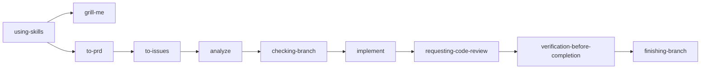

# Skills

lihuanyu 个人的 Codex skill 仓库，用于沉淀、维护和迭代可复用 workflow skills。

## 核心链路



## Skills

| Skill | 用途 |
| --- | --- |
| `using-skills` | 任务入口和 skill 路由 |
| `constitution` | 项目原则、质量门和流程治理 |
| `clarify` | 源码解释、调用链、图表和报告 |
| `grill-me` | 追问方案、约束、风险和验收 |
| `to-prd` | 将上下文整理成本地 PRD |
| `to-issues` | 将 PRD/plan/spec 拆成本地 issues |
| `analyze` | 只读检查 artifacts 一致性和覆盖率 |
| `checking-branch` | 确认当前开发分支、Git 状态和 baseline |
| `implement` | 按 TDD 执行实现 |
| `diagnose` | 通用 bug / 性能回归诊断 |
| `diagnose-ue` | Unreal Engine 问题诊断 |
| `requesting-code-review` | 两阶段实现评审 |
| `verification-before-completion` | 完成前验证质量门 |
| `finishing-branch` | 开发分支收尾和交付选项 |
| `writing-skills` | 新增/修改 skill 的压力场景和验证流程 |

## 开发原则

- 主要语言使用中文。
- Skill 结构要求、文件名、目录名、YAML frontmatter key、配置字段、命令、代码、API 名称、英文专业术语和英文专有名词保留英文。
- 新增或修改 skill 时，先使用 `writing-skills`，再运行本地 validator。
- 非平凡实现链路优先使用 `to-prd -> to-issues -> analyze -> checking-branch -> implement -> requesting-code-review -> verification-before-completion`。

## 验证

```powershell
python scripts/validate-skills.py
```
