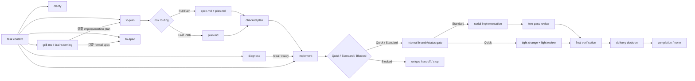

# Skills

lihuanyu 个人的 Codex skill 仓库，用于沉淀、维护和迭代可复用 workflow skills。

## 核心链路


```mermaid
flowchart LR
  Start["task context"] --> Clarify["clarify"]
  Start --> Need["grill-me / brainstorming"]
  Start --> Diagnose["diagnose"]
  Start --> Implement["implement"]
  Need -->|"需要 implementation plan"| Plan["to-plan"]
  Need -->|"只要 formal spec"| SpecOnly["to-spec"]
  Start --> Plan
  Start --> SpecOnly
  Diagnose -->|"repair-ready"| Implement
  Plan --> Risk{"risk routing"}
  Risk -->|"Fast Path"| Fast["plan.md"]
  Risk -->|"Full Path"| Full["spec.md + plan.md"]
  Fast --> Checked["checked plan"]
  Full --> Checked
  Checked --> Implement
  Implement --> Path{"Quick / Standard / Blocked"}
  Path -->|"Quick / Standard"| Branch["internal branch/status gate"]
  Path -->|"Blocked"| Blocked["unique handoff / stop"]
  Branch -->|"Quick"| QuickWork["tight change + light review"]
  Branch -->|"Standard"| Work["serial implementation"]
  QuickWork --> Verify["final verification"]
  Work --> Review["two-pass review"]
  Review --> Verify["final verification"]
  Verify --> Delivery["delivery decision"]
  Delivery --> Done["completion / none"]
```

workflow skills 不自动串联。每个 skill 完成后只报告结果和必要的后续选项；用户需要下一步时显式调用目标 skill。后续建议不授权代码、测试、branch、review、commit、push 或其他远端操作。

设计确认后需要 implementation plan 时，`brainstorming` 报告 `$to-plan` 作为后续选项；用户显式调用后创建一次 Planning Authorization：`$to-plan` 根据风险自动选择 Fast Path 或 Full Path，在同一次 Planning Run 内生成所需 artifacts、闭环机械 findings 并交付 checked plan。Fast 只写自包含 `plan.md`；Full 写共享 `FR-###` 的 `spec.md + plan.md`；两者都不默认生成 `analysis.md`。

独立 `$to-spec` 用于用户只需要 formal spec / decision artifact 的场景；已有或外部 artifacts 的质量检查由 `$to-plan` 的 Planning Run 或 `$implement` 的内部 artifact quality gate 负责，不再依赖独立 audit Skill。

Planning Authorization 不会绕过目标 skill 的安全门。planning 只授权本地 planning artifacts；实现类 skill 仍必须处理自己的 scope、branch、verification、review、commit 和 push gate。

## Skills

| Skill | 用途 |
| --- | --- |
| `clarify` | 源码解释、调用链、图表和报告；只回答问题，不推荐后续 skill |
| `brainstorming` | 设计前澄清目标、比较方案，并路由 checked plan、formal spec 或结束 |
| `grill-me` | 追问方案、约束、风险和验收 |
| `to-spec` | 独立生成叙事型 formal spec 和需求/决策契约 |
| `to-plan` | 按风险生成 Fast/Full planning artifacts 与 checked plan |
| `tdd` | 按 RED/GREEN/REFACTOR 循环推进测试先行实现 |
| `implement` | 唯一实现入口；写入前选择 Quick/Standard/Blocked，并内部执行 branch、artifact、review、verification 和 delivery gates |
| `diagnose` | 唯一诊断入口；按 Generic/UE Profile 与 Active Repro/Artifact-based Triage 产出 root cause 和修复入口 |
| `improve-codebase-architecture` | 架构加深、重构机会和 testability 改进 |
| `handoff` | 生成跨会话交接文档，方便下一位 agent 接手 |
| `session-curator` | 会话结束后手动提炼通用经验，确认计划后同步项目文档、agent 规则和记忆 |

## 开发原则

- 主要语言使用中文。
- Skill 结构要求、文件名、目录名、YAML frontmatter key、配置字段、命令、代码、API 名称、英文专业术语和英文专有名词保留英文。
- `Skills/` 采用[完整包中文化](docs/wiki/skills/skill-package-localization.md)：`SKILL.md`、`references/`、`examples/`、模板及其他包内人类说明全部使用中文主文。
- `Skills/` 下当前及未来 `SKILL.md` 的 `description` 值与普通正文使用中文主文；当中文会降低准确性或触发识别效果时，只保留有验证证据的必要 English trigger phrases。
- 代码、命令、API 名称、contract fields、稳定 ID、英文专有名词和必要技术术语保留 English。
- 既有 `Trigger Description`、`Pressure Scenarios` 使用中文标题加 English 括注；其他普通 section heading 使用中文。
- `Skills-ZH/` 是 submodules 参考 Skill 的开发对照资料，不用于发行或实际使用；其中文化遵循 [`Skills-ZH` 参考 Skill 中文化规则](docs/wiki/skills/skill-zh-localization.md)。
- 新增或修改 skill 时，明确 pressure scenarios、trigger description 和 metadata，再运行本地 validator。
- workflow skill 完成后只报告必要的后续选项；用户显式调用目标 skill，不能跨过其内部安全门。
- `clarify` 是只读解释路径，完成后自然结束，不推荐后续 skill。
- `grill-me`、`brainstorming` 和 `diagnose` 不直接写业务代码；repair-ready diagnosis 报告 `$implement` 作为后续选项。
- 普通 implementation request 直接进入 `$implement`；它在写入前选择 Quick/Standard/Blocked，可执行路径再由内部 N1 branch/status gate 确认分支。
- 小、清楚、低风险且可快速验证的 feature 或 bug fix 由 `$implement` 选择 Quick Path；风险扩大时在同一 skill 内升级 Standard。
- 需要 checked plan 时直接进入 `$to-plan`：Fast Path 处理边界明确的普通需求，Full Path 固化 public contract、schema、migration、核心 workflow 或跨模块高风险决策。
- `Planning Quality Status: Pass` 的 checked plan 可直接进入 `$implement` 的 N1 branch/status gate；未检查、失效或 external artifacts 进入 `$implement` Standard，再由内部 N3 artifact quality gate 做只读核对，不在 implementation entry 前另行路由。

## 验证

```powershell
python scripts/validate-skills.py
```
