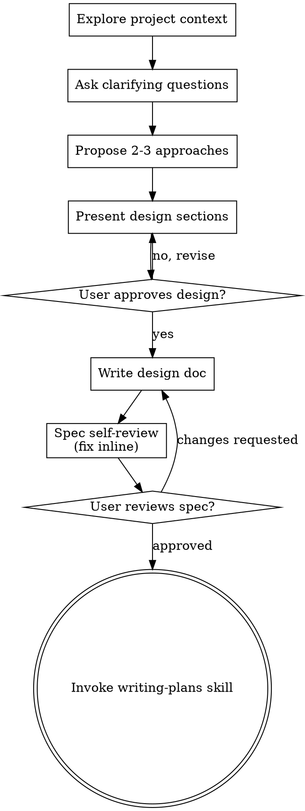

> **`description` 中文译文：** 在开展任何创造性工作（创建 feature、构建 component、添加功能或修改行为）之前，你必须使用此 Skill。它会在实现前探索用户意图、需求和设计。

# Brainstorming Ideas Into Designs（把想法通过头脑风暴转化为设计）

Help turn ideas into fully formed designs and specs through natural collaborative dialogue.

> **中文译文：** 通过自然的协作式对话，帮助把想法转化为完整成形的设计和 spec。

Start by understanding the current project context, then ask questions one at a time to refine the idea. Once you understand what you're building, present the design and get user approval.

> **中文译文：** 先理解当前项目的 context，然后一次提出一个问题来完善想法。一旦理解了要构建的内容，就呈现设计并获得用户批准。

<HARD-GATE>
Do NOT invoke any implementation skill, write any code, scaffold any project, or take any implementation action until you have presented a design and the user has approved it. This applies to EVERY project regardless of perceived simplicity.

> **中文译文：** 在呈现设计且用户批准之前，不得调用任何实现类 skill、编写任何代码、搭建任何项目脚手架或采取任何实现性动作。无论项目看起来多么简单，这都适用于每一个项目。
</HARD-GATE>

## Anti-Pattern: "This Is Too Simple To Need A Design"（反模式：“这太简单，不需要设计”）

Every project goes through this process. A todo list, a single-function utility, a config change — all of them. "Simple" projects are where unexamined assumptions cause the most wasted work. The design can be short (a few sentences for truly simple projects), but you MUST present it and get approval.

> **中文译文：** 每个项目都要经历这一流程。todo list、单函数 utility、config 修改——无一例外。“简单”项目恰恰最容易因未经审视的假设而浪费大量工作。设计可以很短（真正简单的项目只需几句话），但你必须呈现设计并获得批准。

## Checklist（检查清单）

You MUST create a task for each of these items and complete them in order:

> **中文译文：** 你必须为下列每一项创建一个 task，并按顺序完成：

1. **Explore project context** — check files, docs, recent commits
2. **Offer the visual companion just-in-time** — NOT upfront. The first time a question would genuinely be clearer shown than described, offer it then (its own message); on approval its browser tab opens for you. If no visual question ever arises, never offer it. See the Visual Companion section below.
3. **Ask clarifying questions** — one at a time, understand purpose/constraints/success criteria
4. **Propose 2-3 approaches** — with trade-offs and your recommendation
5. **Present design** — in sections scaled to their complexity, get user approval after each section
6. **Write design doc** — save to `docs/superpowers/specs/YYYY-MM-DD-<topic>-design.md` and commit
7. **Spec self-review** — quick inline check for placeholders, contradictions, ambiguity, scope (see below)
8. **User reviews written spec** — ask user to review the spec file before proceeding
9. **Transition to implementation** — invoke writing-plans skill to create implementation plan

> **中文译文：**
> 1. **探索项目 context** —— 检查文件、文档和最近的 commit。
> 2. **在恰当时机提供 Visual Companion** —— 不得预先提供。第一次遇到用展示确实比文字描述更清楚的问题时，再以单独一条消息提供；用户批准后，其浏览器 tab 会为你打开。如果始终没有视觉问题，就绝不要提供。参见下文 Visual Companion 一节。
> 3. **提出澄清问题** —— 一次一个，理解目的、约束和成功标准。
> 4. **提出 2-3 种方案** —— 说明 trade-off，并给出你的推荐。
> 5. **呈现设计** —— 按复杂度分节呈现，每节后获得用户批准。
> 6. **编写设计文档** —— 保存到 `docs/superpowers/specs/YYYY-MM-DD-<topic>-design.md` 并 commit。
> 7. **Spec 自审** —— 就地快速检查占位符、矛盾、歧义和 scope（见下文）。
> 8. **用户审阅书面 spec** —— 继续前请用户审阅 spec 文件。
> 9. **过渡到实现** —— 调用 writing-plans skill 创建实现计划。

## Process Flow（流程）

> **中文译文：** 流程依次为：探索项目 context、提出澄清问题、比较方案、分节呈现设计并循环修订，随后编写和自审设计文档。用户审阅书面 spec；若要求修改则返回修改文档，批准后才调用 writing-plans skill。

**The terminal state is invoking writing-plans.** Do NOT invoke frontend-design, mcp-builder, or any other implementation skill. The ONLY skill you invoke after brainstorming is writing-plans.

> **中文译文：** **终止状态是调用 writing-plans。** 不得调用 frontend-design、mcp-builder 或任何其他实现类 skill。brainstorming 之后唯一可以调用的 skill 是 writing-plans。

## The Process（流程细则）

**Understanding the idea:**

> **中文译文：** **理解想法：**

- Check out the current project state first (files, docs, recent commits)
- Before asking detailed questions, assess scope: if the request describes multiple independent subsystems (e.g., "build a platform with chat, file storage, billing, and analytics"), flag this immediately. Don't spend questions refining details of a project that needs to be decomposed first.
- If the project is too large for a single spec, help the user decompose into sub-projects: what are the independent pieces, how do they relate, what order should they be built? Then brainstorm the first sub-project through the normal design flow. Each sub-project gets its own spec → plan → implementation cycle.
- For appropriately-scoped projects, ask questions one at a time to refine the idea
- Prefer multiple choice questions when possible, but open-ended is fine too
- Only one question per message - if a topic needs more exploration, break it into multiple questions
- Focus on understanding: purpose, constraints, success criteria

> **中文译文：**
> - 先查看当前项目状态（文件、文档和最近的 commit）。
> - 提出详细问题前先评估 scope：如果请求描述了多个相互独立的子系统（例如“构建一个包含 chat、文件存储、计费和分析的平台”），应立刻指出。不要花问题去完善一个本应先拆分的项目细节。
> - 如果项目太大，无法放进单一 spec，帮助用户拆成子项目：哪些部分相互独立、它们如何关联、应按什么顺序构建？然后按正常设计流程对第一个子项目进行 brainstorm。每个子项目都有各自的 spec → plan → implementation 循环。
> - 对 scope 合适的项目，一次提出一个问题来完善想法。
> - 尽可能优先使用多项选择题，但开放式问题也可以。
> - 每条消息只问一个问题；如果某个主题需要深入探索，就拆成多个问题。
> - 聚焦理解目的、约束和成功标准。

**Exploring approaches:**

> **中文译文：** **探索方案：**

- Propose 2-3 different approaches with trade-offs
- Present options conversationally with your recommendation and reasoning
- Lead with your recommended option and explain why
- YAGNI ruthlessly - remove unnecessary features from every approach and design

> **中文译文：**
> - 提出 2-3 种不同方案并说明 trade-off。
> - 以对话方式呈现选项，同时说明推荐和理由。
> - 先给出推荐方案并解释原因。
> - 严格贯彻 YAGNI，从每种方案和设计中移除不必要的功能。

**Presenting the design:**

> **中文译文：** **呈现设计：**

- Once you believe you understand what you're building, present the design
- Scale each section to its complexity: a few sentences if straightforward, up to 200-300 words if nuanced
- Ask after each section whether it looks right so far
- Cover: architecture, components, data flow, error handling, testing
- Be ready to go back and clarify if something doesn't make sense

> **中文译文：**
> - 一旦认为自己已经理解要构建的内容，就呈现设计。
> - 每节篇幅应与复杂度相称：直观内容只需几句话，有细微之处的内容最多 200-300 词。
> - 每节后询问目前看起来是否正确。
> - 覆盖 architecture、component、data flow、错误处理和测试。
> - 如果某处讲不通，应随时回头澄清。

**Design for isolation and clarity:**

> **中文译文：** **为隔离性和清晰度而设计：**

- Break the system into smaller units that each have one clear purpose, communicate through well-defined interfaces, and can be understood and tested independently
- For each unit, you should be able to answer: what does it do, how do you use it, and what does it depend on?
- Can someone understand what a unit does without reading its internals? Can you change the internals without breaking consumers? If not, the boundaries need work.
- Smaller, well-bounded units are also easier for you to work with - you reason better about code you can hold in context at once, and your edits are more reliable when files are focused. When a file grows large, that's often a signal that it's doing too much.

> **中文译文：**
> - 把系统拆成更小的单元：每个单元只承担一个明确目的，通过定义良好的 interface 通信，并且可以独立理解和测试。
> - 对每个单元，你都应能回答：它做什么、如何使用、依赖什么？
> - 别人能否不读内部实现就理解单元的用途？你能否修改内部实现而不破坏 consumer？如果不能，边界还需要改进。
> - 较小且边界清晰的单元也更便于你工作：当代码能一次装进 context 时，你的推理更好；当文件职责聚焦时，你的编辑更可靠。文件不断变大，往往意味着它承担了太多职责。

**Working in existing codebases:**

> **中文译文：** **在现有代码库中工作：**

- Explore the current structure before proposing changes. Follow existing patterns.
- Where existing code has problems that affect the work (e.g., a file that's grown too large, unclear boundaries, tangled responsibilities), include targeted improvements as part of the design - the way a good developer improves code they're working in.
- Don't propose unrelated refactoring. Stay focused on what serves the current goal.

> **中文译文：**
> - 提出修改前先探索当前结构，并遵循现有 pattern。
> - 如果现有代码存在影响当前工作的问题（例如文件过大、边界不清、职责纠缠），把有针对性的改进纳入设计——就像优秀开发者会改进自己正在处理的代码一样。
> - 不要提出无关的 refactoring；聚焦服务当前目标的内容。

## After the Design（设计之后）

**Documentation:**

> **中文译文：** **文档：**

- Write the validated design (spec) to `docs/superpowers/specs/YYYY-MM-DD-<topic>-design.md`
  - (User preferences for spec location override this default)
- Use elements-of-style:writing-clearly-and-concisely skill if available
- Commit the design document to git

> **中文译文：**
> - 把已验证的设计（spec）写入 `docs/superpowers/specs/YYYY-MM-DD-<topic>-design.md`。
>   - 用户对 spec 位置的偏好会覆盖这个默认值。
> - 如果可用，使用 elements-of-style:writing-clearly-and-concisely skill。
> - 把设计文档 commit 到 git。

**Spec Self-Review:**

> **中文译文：** **Spec 自审：**
After writing the spec document, look at it with fresh eyes:

> **中文译文：** 写完 spec 文档后，换一个全新的视角重新审视它：

1. **Placeholder scan:** Any "TBD", "TODO", incomplete sections, or vague requirements? Fix them.
2. **Internal consistency:** Do any sections contradict each other? Does the architecture match the feature descriptions?
3. **Scope check:** Is this focused enough for a single implementation plan, or does it need decomposition?
4. **Ambiguity check:** Could any requirement be interpreted two different ways? If so, pick one and make it explicit.

> **中文译文：**
> 1. **占位符扫描：** 是否有任何 "TBD"、"TODO"、未完成的小节或含糊的需求？修复它们。
> 2. **内部一致性：** 各小节是否相互矛盾？architecture 是否与 feature 描述匹配？
> 3. **Scope 检查：** 内容是否足够聚焦，可以由单一实现计划完成，还是需要拆分？
> 4. **歧义检查：** 是否有任何需求可以被解释成两种不同含义？如果有，选择一种并明确写出。

Fix any issues inline. No need to re-review — just fix and move on.

> **中文译文：** 就地修复所有问题。无需再次审阅——修复后继续即可。

**User Review Gate:**

> **中文译文：** **用户审阅关卡：**
After the spec review loop passes, ask the user to review the written spec before proceeding:

> **中文译文：** spec 审阅循环通过后，继续前请用户审阅书面 spec：

> "Spec written and committed to `<path>`. Please review it and let me know if you want to make any changes before we start writing out the implementation plan."

> **中文译文：** “Spec 已写入并 commit 到 `<path>`。请审阅并告诉我是否需要修改，然后我们再开始编写实现计划。”

Wait for the user's response. If they request changes, make them and re-run the spec review loop. Only proceed once the user approves.

> **中文译文：** 等待用户响应。如果用户要求修改，就进行修改并重新运行 spec 审阅循环。只有用户批准后才能继续。

**Implementation:**

> **中文译文：** **实现：**

- Invoke the writing-plans skill to create a detailed implementation plan
- Do NOT invoke any other skill. writing-plans is the next step.

> **中文译文：**
> - 调用 writing-plans skill 创建详细的实现计划。
> - 不得调用任何其他 skill。下一步是 writing-plans。

## Visual Companion（可视化伴随工具）

A browser-based companion for showing mockups, diagrams, and visual options during brainstorming. Available as a tool — not a mode. Accepting the companion means it's available for questions that benefit from visual treatment; it does NOT mean every question goes through the browser.

> **中文译文：** 这是一个基于浏览器的 companion，用于在 brainstorming 期间展示 mockup、diagram 和视觉选项。它是一个 tool，而不是一种模式。接受 companion 表示它可以用于适合视觉呈现的问题；这并不意味着每个问题都要通过浏览器处理。

**Offering the companion (just-in-time):** Do NOT offer it upfront. Wait until a question would genuinely be clearer shown than told — a real mockup / layout / diagram question, not merely a UI *topic*. The first time that happens, offer it then, as its own message:
> "This next part might be easier if I show you — I can put together mockups, diagrams, and comparisons in a browser tab as we go. It's still new and can be token-intensive. Want me to? I'll open it for you."

> **中文译文：** **在恰当时机提供 companion：** 不得预先提供。等到某个问题确实用展示比文字说明更清楚时再提供——必须是真正的 mockup、layout 或 diagram 问题，而不只是 UI *话题*。第一次出现这种情况时，以单独一条消息提供：
>
> “接下来的内容如果直接展示，可能更容易理解——我可以在浏览器 tab 中边讨论边制作 mockup、diagram 和对比。这个功能还很新，可能消耗较多 token。要使用吗？我会为你打开它。”

**This offer MUST be its own message.** Only the offer — no clarifying question, summary, or other content. Wait for the user's response. If they accept, start the server with `--open` so their browser opens to the first screen automatically. If they decline, continue text-only and don't offer again unless they raise it.

> **中文译文：** **这项提供必须单独成为一条消息。** 该消息只能包含提供内容，不得包含澄清问题、摘要或其他内容。等待用户响应。如果用户接受，使用 `--open` 启动 server，使其浏览器自动打开第一个 screen。如果用户拒绝，就继续使用纯文本；除非用户主动提出，否则不要再次提供。

**Per-question decision:** Even after the user accepts, decide FOR EACH QUESTION whether to use the browser or the terminal. The test: **would the user understand this better by seeing it than reading it?**

> **中文译文：** **逐题决策：** 即使用户已经接受，也要为每一个问题分别决定使用浏览器还是 terminal。判断标准是：**用户通过看而不是读，是否能更好地理解？**

- **Use the browser** for content that IS visual — mockups, wireframes, layout comparisons, architecture diagrams, side-by-side visual designs
- **Use the terminal** for content that is text — requirements questions, conceptual choices, tradeoff lists, A/B/C/D text options, scope decisions

> **中文译文：**
> - 对本身就是视觉性的内容使用浏览器——mockup、wireframe、layout 对比、architecture diagram 和并排的视觉设计。
> - 对文本内容使用 terminal——需求问题、概念性选择、trade-off 列表、A/B/C/D 文本选项和 scope 决策。

A question about a UI topic is not automatically a visual question. "What does personality mean in this context?" is a conceptual question — use the terminal. "Which wizard layout works better?" is a visual question — use the browser.

> **中文译文：** 关于 UI 话题的问题并不会自动成为视觉问题。“在这个 context 中 personality 是什么意思？”属于概念性问题——使用 terminal。“哪种 wizard layout 更好？”属于视觉问题——使用浏览器。

If they agree to the companion, read the detailed guide before proceeding:
`skills/brainstorming/visual-companion.md`

> **中文译文：** 如果用户同意使用 companion，请先阅读详细指南 `skills/brainstorming/visual-companion.md`，再继续。
