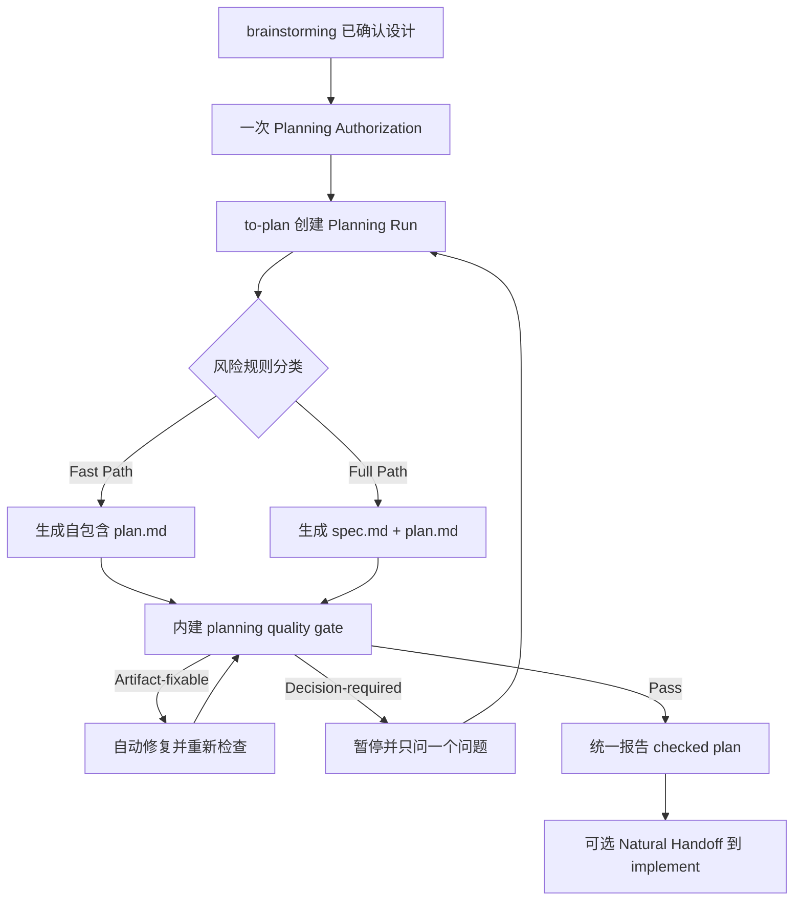

# Adaptive Planning Workflow Spec

## 元数据 (Metadata)

- **Status**: Approved
- **Source**: conversation context、当前 `brainstorming` / `to-spec` / `to-plan` / `analyze` contracts，以及现有 workflow artifacts
- **Generated at**: 2026-07-10
- **Feature Slug**: adaptive-planning-workflow
- **Supersedes**: `docs/features/spec-plan-workflow/prd.md` 中“所有非平凡需求固定经过独立 `to-spec -> to-plan -> analyze` 阶段”的相关决策；不改写其历史记录

## 问题陈述 (Problem Statement)

当前 planning workflow 将一次已经在 `brainstorming` 中确认的设计，依次转换为 handoff packet、`spec.md`、`plan.md` 和只读 analysis 结果。每个 skill 都有清晰职责，但串联体验存在三个摩擦点：同一上下文被重复读取和重述；每个 skill 边界都会触发一次 `Natural Handoff`；`analyze` 在 plan 生成后才发现机械问题，而且默认只报告、不修复 artifacts。

这种固定链路对涉及 public contract、schema、迁移或跨 module 协作的高风险需求有价值，但对目标单一、边界明确、已有 verification seam 的普通需求过重。用户需要的是一份经过一致性检查、可以安全交给实现阶段的 implementation plan，而不是为了维护 skill 边界而经历多次确认。

## 目标 (Goals)

- 用户在 `brainstorming` 确认设计后，只需一次 Planning Authorization，即可得到经过质量检查的 implementation plan。
- 根据可审计的风险规则自动选择 Fast Path 或 Full Path，而不是让用户每次手动选择流程。
- 保留 requirements、tasks、contracts 和 verification 的完整 traceability。
- 将 plan 生成过程中的机械一致性检查前移，并自动修复不改变需求语义的 artifact findings。
- 保留独立 `$to-spec` 和 `$analyze` 的使用场景，同时不降低 implementation、branch、review、verification、commit 或 push 安全门。

## 方案与架构 (Approach and Architecture)

`to-plan` 成为 planning outcome owner。`brainstorming` 在设计确认后只向 `$to-plan` 交接；用户的一次自然确认或显式调用创建一个 Planning Run。Planning Run 负责风险分类、artifact 生成、内建质量检查、允许的机械修复和最终统一报告，并在完成 checked plan 后停止在实现之前。

### Planning Authorization

当 `brainstorming` 已完成设计并唯一推荐 `$to-plan` 时，用户回复 `继续`、`可以`、`按你说的办`、`go ahead`、`ok`、`好的`，或显式调用 `$to-plan`，即授权一次 Planning Run：

- 读取与已确认设计直接相关的代码、文档和 artifacts。
- 自动选择 Fast Path 或 Full Path，并说明命中的风险规则。
- 写入该路径要求的本地 planning artifacts。
- 修复 Artifact-fixable findings，并重新运行 planning quality gate。

Planning Authorization 不授权修改业务代码或测试，不授权创建或切换分支，也不授权 commit、push、PR、merge、discard 或任何远端操作。遇到 Decision-required finding 时，Planning Run 暂停并只问一个最高优先级问题；用户回答后恢复同一 Planning Run，不要求重新授权。

### 风险路由 (Risk Routing)

Fast Path 必须同时满足：

- 设计方向已经确认，目标单一且边界清楚。
- 不改变 public API、schema、migration、权限、安全或数据生命周期。
- 不跨 repository 或多个相互独立的 subsystem。
- acceptance criteria 和 verification seam 已经明确。
- 没有会改变实现方向的开放决策。

Full Path 命中任一条件即可进入：

- 改变 public contract、schema、持久化结构或核心 workflow。
- 涉及兼容性、migration、权限、安全或数据丢失风险。
- 跨多个 module 或 repository，且存在需要长期稳定的接口交接。
- 包含多个相互依赖的用户流程或 rollout 阶段。
- 关键 non-goal、acceptance 或 architecture decision 需要独立 artifact 长期固化。
- 用户明确要求正式 spec 或 decision artifact。

Agent 必须在 Planning Run 开始时用一句话说明选择的路径和命中的规则。只有证据互相冲突或无法可靠分类时，才允许暂停询问。

### Artifact Contract

Fast Path 只生成 `plan.md`。该 plan 必须自包含：

- `Planning Mode: Fast` 和风险分类依据。
- 稳定的 `FR-###` requirements。
- 顺序 tasks、精确文件路径、`Consumes/Produces` contracts、acceptance criteria 和 verification commands。
- `FR-### -> Task -> Verification` coverage。
- 内建 planning quality gate 的最终状态。

Fast Path 不生成 `spec.md`、`analysis.md` 或新的 `manifest.md`。

Full Path 生成 `spec.md` 和 `plan.md`：spec 固化问题、方案、决策、non-goals、`FR-###` 和 verification seam；plan 使用相同 `FR-###` 拆分顺序 tasks。Full Path 不生成独立 `analysis.md`；feature workspace 已经存在 `manifest.md` 时更新状态，项目没有该惯例时不强制创建。

### 内建 Planning Quality Gate

内建检查至少覆盖：

- 每条 `FR-###` 是否被 task 的 `Covers` 覆盖。
- 每个 task 是否有精确 `Files`、`Consumes`、`Produces`、acceptance criteria 和 verification command。
- 相邻 task 的 `Consumes/Produces` 名称和类型是否一致。
- 文件路径、命令和既有 interface 是否与仓库事实一致。
- non-goals、global constraints、风险和 verification seam 是否在 plan 中得到保留。

Findings 分为两类：

- **Artifact-fixable**：coverage 表遗漏、task 字段遗漏、可由源码确认的路径错误、`Consumes/Produces` 命名不一致、manifest 状态错误、模板残留等不改变需求语义的问题。Planning Run 自动修复并重新检查，不打断用户。
- **Decision-required**：需求冲突、scope 或 acceptance 需要变化、存在多个实质不同的架构选择、兼容性或 migration 取舍不明确、缺少无法从仓库确认的业务事实。Planning Run 必须暂停，一次只问一个问题。

## 关键决策与取舍 (Key Decisions and Tradeoffs)

- **决策**: 让 `to-plan` 成为 planning outcome owner。**理由**: 用户需要的是 checked plan，单一入口可以在不放宽全局跨-skill协议的情况下消除中间 handoff。**被排除的方案**: 新增 `prepare-plan` 会增加一个与现有能力重叠的 skill；由 `workflow-router` 授权 `to-spec -> to-plan -> analyze` 连续执行会给 `Natural Handoff` 引入复杂的跨-skill状态和例外。
- **决策**: spec 按风险自适应。**理由**: 普通需求不应承担独立叙事 artifact 的固定成本，高风险需求仍需要长期 decision record。**被排除的方案**: 始终生成 spec 会保留当前冗余；完全取消 spec 会削弱复杂需求的可追溯性。
- **决策**: 将 analysis 作为 `to-plan` 内建质量门，而不是默认独立阶段。**理由**: 机械问题应在 producer 内闭环，避免先产出再报告再等待修复。**被排除的方案**: 所有 findings 都等待确认会恢复当前低效体验；所有 findings 都由 agent 自行处理可能静默改变需求。
- **决策**: Planning Authorization 只覆盖本地 planning artifacts。**理由**: 一次确认可以减少文档工作流摩擦，但不能成为代码、分支或远端操作的隐式授权。
- **决策**: 保留独立 `$to-spec` 与 `$analyze`。**理由**: 用户可能只需要正式 spec，或需要对已有/外部 artifacts 做只读审计；优化默认链路不等于删除独立能力。

## 非目标 (Non-Goals)

- 不在 planning 阶段修改业务代码、测试或 runtime behavior。
- 不取消 `checking-branch`、`requesting-code-review`、`verification-before-completion` 或 `finishing-branch` 的安全门。
- 不把 `$quick-change` 纳入 Planning Run；小、清楚、低风险且可快速验证的直接改动继续使用其独立链路。
- 不让 Fast Path 降级 requirements、coverage、interface contracts 或 verification commands 的完整性。
- 不让 `to-plan` 自动 commit、push、创建 PR 或调用远端 tracker。
- 不修改既有历史 feature artifacts；旧文档通过 supersession 说明保留为历史记录。

## 功能需求 (Functional Requirements)

- **FR-001**: `brainstorming` 在整体设计确认且需要 implementation plan 时，必须唯一推荐 `$to-plan`，不得再把 `$to-spec` 作为默认中转站。
- **FR-002**: `brainstorming` 的 planning handoff packet 必须包含 confirmed goal、scope、non-goals、chosen approach、rejected alternatives、key decisions、risks、open questions 和 verification seam，使 `$to-plan` 无需重复开展设计澄清。
- **FR-003**: 用户对 `brainstorming` 唯一推荐的 `$to-plan` 做自然确认或显式调用时，必须创建一次 Planning Authorization，并允许该 Planning Run 连续完成风险分类、artifact 写入、机械修复和质量检查。
- **FR-004**: Planning Authorization 必须明确排除业务代码/测试修改、branch 操作、commit、push、PR、merge、discard 和远端操作；checked plan 完成前不得进入 implementation。
- **FR-005**: `to-plan` 必须根据本 spec 的风险矩阵自动选择 Fast Path 或 Full Path，并在开始时报告所选路径及至少一个可审计的命中依据。
- **FR-006**: 只有风险证据冲突或无法可靠分类时，`to-plan` 才能为路径选择暂停，并且一次最多询问一个阻塞问题。
- **FR-007**: Fast Path 必须只生成一个自包含 `plan.md`，不得默认生成 `spec.md`、`analysis.md` 或新的 `manifest.md`。
- **FR-008**: Fast Path 的 `plan.md` 必须包含 `Planning Mode: Fast`、风险依据、稳定 `FR-###`、顺序 tasks、精确文件路径、`Consumes/Produces`、`Covers`、acceptance criteria、verification commands、coverage 自查和最终质量门状态。
- **FR-009**: Full Path 必须在同一次 Planning Run 内生成共享同一组 `FR-###` 的 `spec.md` 和 `plan.md`，不得在两个 artifact 之间要求中间用户确认。
- **FR-010**: Full Path 不得默认生成独立 `analysis.md`；已有 `manifest.md` 时必须更新，否则不得仅为本流程强制创建 manifest。
- **FR-011**: `to-plan` 的内建 quality gate 必须检查 requirements coverage、task completeness、`Consumes/Produces` 一致性、真实文件路径、verification commands 和 global constraints。
- **FR-012**: Artifact-fixable findings 必须由 Planning Run 自动修复并重新检查，直到通过或被重新分类为 Decision-required；不得把机械修复逐项交给用户确认。
- **FR-013**: Decision-required findings 必须暂停 Planning Run，一次只问一个最高优先级问题；用户回答后必须恢复同一 Planning Run，而不是要求重新授权或重新执行前置阶段。
- **FR-014**: 完成 quality gate 后，`to-plan` 必须只做一次最终汇报，说明 Planning Mode、artifact 路径、coverage、自动修复摘要、assumptions 和 residual risks。
- **FR-015**: checked plan 已达到 implementation-ready 且没有阻塞问题时，`to-plan` 可以通过一次新的 `Natural Handoff` 唯一推荐 `$implement`；该确认只进入 `implement`，不得绕过其 branch、scope、review 或 verification gate。
- **FR-016**: 用户显式调用 `$to-spec` 时，必须继续支持只产出正式 spec 的独立场景，不被强制转换为 Planning Run。
- **FR-017**: 用户显式调用 `$analyze` 审查已有或外部 artifacts 时，必须继续保持只读分析行为；它不再是默认 planning chain 的必经阶段。
- **FR-018**: 用户直接调用 `$to-plan` 并提供现有 spec 时，必须复用该 spec 的 `FR-###` 进入 Full Path；只有 conversation context 时，必须按风险矩阵决定是否补写 spec。
- **FR-019**: repo-level workflow docs、skill metadata 和 validator-facing contract 必须同步描述 adaptive planning，且不得继续宣称所有复杂任务固定经过 `$to-spec -> $to-plan -> $analyze`。
- **FR-020**: adaptive planning 的实现不得改变 `$quick-change`、`implement`、branch、review、verification、commit 或 push 的既有授权边界。

## 成功标准 (Success Criteria)

- **SC-001**: 普通需求从 `brainstorming` 设计确认到 checked plan 最多需要一次用户授权，且无 Decision-required finding 时中间没有 skill handoff。
- **SC-002**: Fast Path 试跑只产生一个 `plan.md`，其中所有 `FR-###` 均映射到至少一个 task 和 verification seam，并且不产生 `spec.md`、`analysis.md` 或新 manifest。
- **SC-003**: Full Path 试跑在一次 Planning Run 内产生 `spec.md` 和 `plan.md`，两者 `FR-###` 完全一致，且不产生 `analysis.md`。
- **SC-004**: 注入一个 Artifact-fixable finding 后，Planning Run 能自动修复、重新检查并完成，而不向用户请求确认。
- **SC-005**: 注入一个 Decision-required finding 后，Planning Run 只提出一个最高优先级问题；回答后继续原运行并完成 artifacts。
- **SC-006**: 每次 Planning Run 的首次状态更新都明确报告 Fast/Full Path 和风险依据，最终报告只出现一次。
- **SC-007**: 显式 `$to-spec` 仍能独立生成正式 spec；显式 `$analyze` 仍能对已有 artifacts 只读输出 findings。
- **SC-008**: Planning Run 全程不修改业务代码或测试，不执行 branch、commit、push、PR、merge、discard 或远端操作。
- **SC-009**: `python scripts/validate-skills.py` 退出码为 0，并覆盖 adaptive planning 的关键 contract marker 或 stale workflow 文案。
- **SC-010**: 仓库级 workflow 文档、`SKILL.md` 和 `agents/openai.yaml` 对 `brainstorming -> to-plan`、Fast/Full Path、内建 quality gate 和独立 `to-spec`/`analyze` 的描述一致。
- **SC-011** (post-launch metric): 无阻塞 planning 会话从设计确认到 checked plan 的用户确认次数由三次降低为一次。

## 测试决策 (Testing Decisions)

- **Verification seam（验证切入点）**: 使用一组 scenario prompts 分别覆盖 Fast Path、Full Path、Artifact-fixable、Decision-required、显式 `$to-spec`、显式 `$analyze` 和 Planning Authorization 越界请求；核对实际 artifact 数量、稳定 ID、coverage、停顿次数和最终报告次数。
- **Prior art（现有依据）**: `to-plan` 已支持从 conversation context 直接写 plan，`analyze` 已定义 coverage/contract/path/verification 检查，`workflow-router` 和 `Natural Handoff` 已定义唯一推荐与自然确认语义。本 feature 重组这些既有能力，不引入新的远端系统。
- **Automated checks（自动检查）**: 运行 `python scripts/validate-skills.py`；使用 `rg` 检查固定 `$to-spec -> $to-plan -> $analyze` 活跃文案、旧 brainstorming 默认 handoff 和缺失 contract marker；对 scenario 产物运行字段与文件数量断言。
- **Manual fallback（手动兜底）**: 如果当前 validator 无法模拟跨 turn 的自然确认，人工执行一轮 Fast Path 和一轮 Full Path，记录用户确认次数、path rationale、artifact 列表、auto-fix loop 和停止边界。

## 风险与开放问题 (Risks and Open Questions)

- **Risk**: `to-plan` 职责扩大后可能变得难以维护。应通过 progressive disclosure 把风险矩阵、artifact contracts 和 quality-gate 细节放入共享 references，主 `SKILL.md` 只保留执行顺序和不可绕过的 contract。
- **Risk**: 自动分类可能把高风险需求误判为 Fast Path。必须使用明确的 Full Path triggers、输出分类依据，并允许用户显式要求 Full Path。
- **Risk**: 自动修复可能越过 artifact 边界并改变需求。Artifact-fixable 白名单必须保守；任何 scope、acceptance、compatibility、migration 或 architecture 变化都归入 Decision-required。
- **Risk**: 现有 `spec-plan-workflow` 和 `natural-handoff-workflow` 文档描述旧链路。新文档必须明确 supersession，活跃 repo docs 必须同步更新，但历史 artifacts 保持不改。
- **Risk**: Fast Path 不创建 manifest，可能与现有 feature workspace 发现逻辑不一致。实现前需要确认仓库没有依赖 manifest 扫描；若存在依赖，应复用现有 manifest 而不是增加用户确认。
- **Open Question**: 无阻塞开放问题。共享 reference 的具体文件组织、validator marker 名称和 scenario fixture 位置交给 plan 基于真实仓库结构确定，不得改变本 spec 的行为 contract。

## Plan 交接说明 (Handoff Notes for Plan)

- 建议按 contract 依赖顺序拆分：先建立共享 risk/artifact/quality-gate contracts，再改造 `to-plan` outcome-owner 流程，然后调整 `brainstorming` handoff 与独立 `to-spec`/`analyze` 边界，最后同步 router、repo docs、metadata、validator 和 scenario verification。
- `to-plan`、`brainstorming`、`workflow-router`、README/AGENTS 和 validator-facing 文案互相约束；涉及默认链路和 stale text 的更新应作为一个原子 task 验证，避免中间状态自相矛盾。
- Plan 必须先检查 manifest 是否被任何当前脚本或 workflow 依赖，再确定 Fast Path 不创建 manifest 的具体落点。
- Plan 必须为 SC-001 至 SC-010 建立明确 task coverage；SC-011 作为 post-launch metric，不作为实现完成的阻塞条件。
- 无需新增用户决策 gate；如果代码事实显示 manifest 依赖或 skill runtime 无法维持同一 Planning Run，必须将其作为 Decision-required finding 返回用户，而不是静默弱化本 spec。
