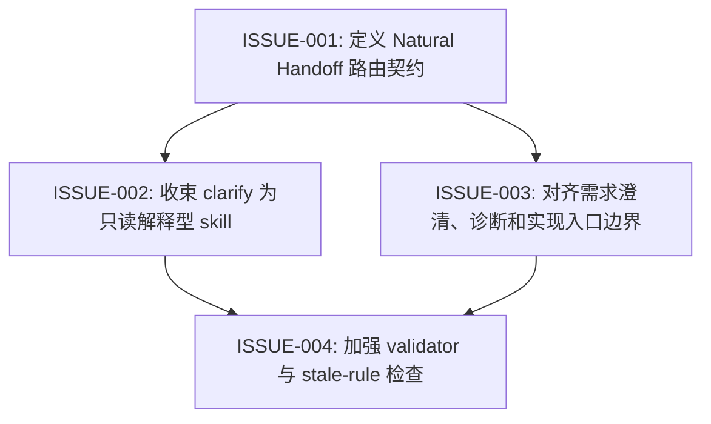

# Natural Handoff Workflow Issues

## 元数据 (Metadata)

- **Source**: `docs/features/natural-handoff-workflow/prd.md`
- **Generated at**: 2026-06-24
- **Status**: Draft

## 假设 (Assumptions)

- 本拆分基于用户已确认的 `Natural Handoff` 方向直接写入，未单独进行 issue preview confirmation。
- `Natural Handoff` 是用户可见交接形式；如果需要保留内部结构化字段，应只作为 agent 自检或 validator 辅助，不直接输出给用户。
- `diagnose` 和 `diagnose-ue` 可以运行复现、测试和临时 instrumentation，但不能在诊断阶段提交持久业务代码修改。
- 自然确认词表先覆盖 PRD 中列出的 `继续`、`可以`、`按你说的办`、`go ahead`、`ok` 和 `好的`；更多变体由实现阶段决定是否加入。

## 需求覆盖 (Requirement Coverage)

| Requirement | Issues | Verification seam | Notes |
| --- | --- | --- | --- |
| FR-001 | ISSUE-001 | `rg "Next Skill Gate"` 和人工审查 router 输出规则 | 替换用户可见字段清单为自然交接 |
| FR-002 | ISSUE-001 | router 文档和样例审查 | 一次最多一个 next skill |
| FR-003 | ISSUE-001 | router 文档和 stale phrase 检查 | 显式确认与自然确认都有效 |
| FR-004 | ISSUE-001 | router 文档和样例审查 | 自然确认只绑定唯一推荐 |
| FR-005 | ISSUE-002 | `clarify/SKILL.md` 审查 | `clarify` 自然结束，不推荐后续 skill |
| FR-006 | ISSUE-003 | `grill-me`、`brainstorming` 文档审查 | 需求澄清类 skill 不写业务代码 |
| FR-007 | ISSUE-003 | `diagnose`、`diagnose-ue` 文档审查 | 诊断类 skill 不直接提交持久实现 |
| FR-008 | ISSUE-003 | quick/full-flow routing 文档审查 | 小改动走 `$quick-change`，复杂变更走完整链路 |
| FR-009 | ISSUE-001 | router 文档审查 | 当前任务路由和跨 skill 下一跳分离 |
| FR-010 | ISSUE-001 | router 与实现类 skill 文档审查 | 自然确认不绕过内部安全门 |
| FR-011 | ISSUE-004 | `python scripts/validate-skills.py` 和 stale phrase 检查 | 防止旧 gate、确认语义和 explicit-only 回漂 |

## 依赖图 (Dependency Graph)

## 执行波次 (Execution Waves)

| Wave | Issues | Parallel guidance |
| --- | --- | --- |
| 1 | ISSUE-001 | 先建立共享 contract，避免后续 skill 使用不同词汇 |
| 2 | ISSUE-002, ISSUE-003 | 可并行编辑不同 skill，但需要复用 ISSUE-001 的同一套 `Natural Handoff` 表述 |
| 3 | ISSUE-004 | 在所有文档语义稳定后更新 validator 和 stale phrase 检查 |

## Subagent 执行指引 (Subagent Execution Guidance)

- 推荐并发数：Wave 1 单 agent；Wave 2 最多 2 个 subagents；Wave 3 单 agent。
- 共享 contracts：`Natural Handoff`、自然确认词表、`recommend-only`、`clarify 不推荐后续 skill`、`诊断不写持久实现代码`。
- human-gate：如果实现时想扩大自然确认词表、保留内部结构化字段，或改变 diagnose 是否允许临时 instrumentation，需要先向用户确认。
- 并行注意：Wave 2 的两个 issues 都可能触碰 `README.md` / `AGENTS.md` 的总览描述，合并时需要统一措辞。

## Issue 索引 (Issue Index)

| ID | Title | Type | Covers | Parallelization | Wave | Depends on | File |
| --- | --- | --- | --- | --- | --- | --- | --- |
| ISSUE-001 | 定义 Natural Handoff 路由契约 | AFK | FR-001, FR-002, FR-003, FR-004, FR-009, FR-010 | sequential | 1 | None | [01-natural-handoff-routing-contract.md](01-natural-handoff-routing-contract.md) |
| ISSUE-002 | 收束 clarify 为只读解释型 skill | AFK | FR-005 | coordination-needed | 2 | ISSUE-001 (hard: 需要先确定共享交接语义) | [02-clarify-readonly-boundary.md](02-clarify-readonly-boundary.md) |
| ISSUE-003 | 对齐需求澄清、诊断和实现入口边界 | AFK | FR-006, FR-007, FR-008 | coordination-needed | 2 | ISSUE-001 (hard: 需要先确定共享交接语义) | [03-planning-diagnosis-implementation-boundaries.md](03-planning-diagnosis-implementation-boundaries.md) |
| ISSUE-004 | 加强 validator 与 stale-rule 检查 | AFK | FR-011 | sequential | 3 | ISSUE-002, ISSUE-003 (hard: 需要最终文案稳定后再固化检查) | [04-validator-and-stale-rule-checks.md](04-validator-and-stale-rule-checks.md) |
