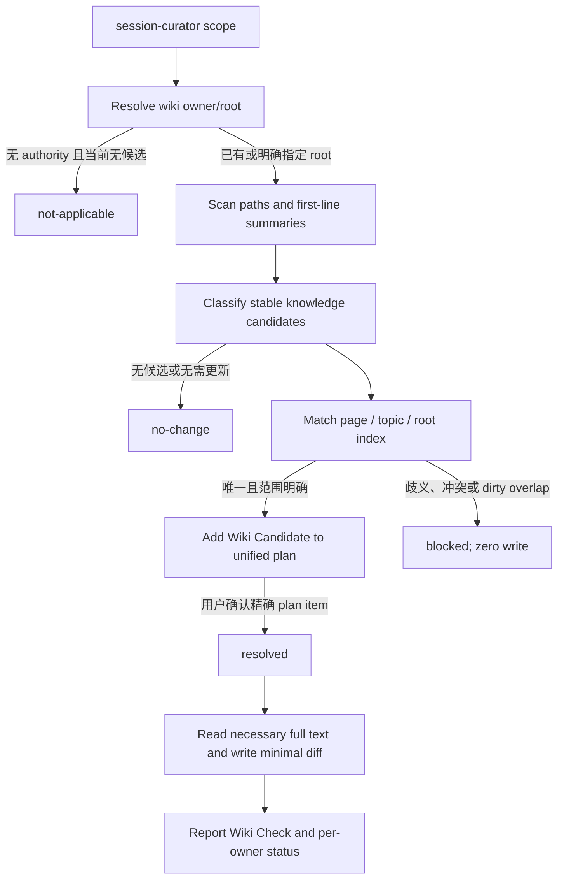

# Session Curator Wiki Profile Spec

## 元数据 (Metadata)

- **Status**: Approved
- **Decision Status**: Conversation-confirmed
- **Planning Mode**: Full
- **Planning Quality Status**: Pass
- **Effective Status**: Effective（2026-07-24）；implementation、静态 validator、discoverability 和 required fresh-session verification 已通过
- **Source**: 2026-07-24 `$grill-me` confirmed decisions；`submodules/swm8023-skills/skills/wiki/SKILL.md`；`submodules/swm8023-skills/docs/wiki/wiki.md`；当前 `session-curator` contract；目标仓库 `AGENTS.md`
- **Generated at**: 2026-07-24
- **Feature Slug**: `session-curator-wiki-profile`
- **Contract Name**: `Session Curator Wiki Profile v1`
- **Plan**: `plan.md`
- **Scope**: 将 wiki 的可发现性、匹配、迁移和授权协议作为 `session-curator` 的受约束 profile
- **Compatibility Note**: 当前工作树中的 `docs/features/artifact-placement/` 是未跟踪的 planning artifact，尚未成为 active contract；本 spec 只与其已确认的 `CuratedDurable`、owner、identity 和 Git delivery 边界兼容，不把该 planning artifact 视为已实现事实

## 问题陈述 (Problem Statement)

目标仓库已有 `session-curator`，能够从会话或指定材料中提炼长期知识，并在用户确认修改计划后更新 README、项目规则、docs 或 memory。但它没有专门定义 wiki 的可发现性和更新协议，容易出现以下问题：

- agent 为了寻找目标页面而读取整个 wiki，增加上下文成本；
- 新页面没有摘要、目录说明或索引，后续难以发现；
- 相近主题被追加到“差不多相关”的页面，逐渐形成重复知识；
- `spec`、`plan`、`handoff` 或 session 内容被全文复制进 wiki，临时过程污染长期知识；
- 当前 cwd、代码仓库和 docs owner 被混淆，wiki 被写入错误的 Git owner；
- 页面匹配存在歧义时，agent 通过 `-2`、`-new` 或 `-final` 创建平行页面；
- 用户确认了宽泛的整理计划，但没有明确批准具体 wiki 文件、section 或转入方式；
- 每次调用 `session-curator` 是否需要检查 wiki 没有可观察、可验证的结果。

`swm8023-skills` 的 wiki skill 已经提供了摘要优先扫描、固定索引树、创建/更新/迁移分流、来源记录和写入前确认等可复用机制。本 feature 将这些机制吸收为 `session-curator` 的 wiki profile，同时保留目标仓库已有的唯一 durable writer、authoritative target、scope、confirmation 和 Git delivery 边界。

## 目标 (Goals)

- 让每次 `session-curator` invocation 都输出一次可观察的 `Wiki Check`。
- 让 wiki 判断复用 `session-curator` 的当前 scope，不因默认检查而触发全仓库扫描或自动 source ingestion。
- 为已有或明确指定的 wiki root 提供一致的摘要、索引、匹配、迁移和冲突处理协议。
- 保持 `session-curator` 为唯一 durable writer，不新增并列的顶层 `wiki` skill。
- 让稳定知识、来源文档、wiki synthesis layer 和 Git owner 之间的边界可验证。
- 在不自动迁移历史页面、不自动创建 generic wiki、不执行 Git delivery 的前提下，减少 wiki 漂移和重复页面。

## 方案与架构 (Approach and Architecture)

### 唯一入口与 profile 选择

wiki profile 不是新的 skill，而是 `session-curator` 的一个受约束工作模式。每次调用 `session-curator` 都必须先完成 wiki 判断，但判断结果可以是 `not-applicable` 或 `no-change`，不代表每次都要写 wiki。

一般的文档或 memory 整理仍由 `session-curator` 的 audience/authority resolver 处理；本 profile 只负责在同一次 curation run 中补充 wiki 判断。明确的“更新 wiki”“建立知识库”“同步到 wiki”等请求直接进入 wiki profile；即使用户没有提及 wiki，`session-curator` 也必须执行轻量级 wiki check。

### Wiki Check 流程

`Wiki Check` 的状态必须是以下值之一：

| Status | 含义 |
| --- | --- |
| `not-applicable` | 当前 scope 没有适合 wiki 的稳定知识，或没有 wiki authority 且本次不需要提出创建候选 |
| `no-change` | wiki authority/root 存在，但当前 scope 没有新增、更新或迁移必要 |
| `candidate` | 发现可能进入 wiki 的内容，但 target、operation 或 transfer mode 尚未获得确认 |
| `resolved` | 精确 target、operation、source、transfer mode 和 scope 已被统一修改计划确认 |
| `blocked` | owner、identity、匹配、dirty overlap 或其他授权条件未收束，必须零写入 |

### Root 与 owner 解析

wiki root 和 `TargetOwnerRoot` 按以下顺序解析：

1. 用户明确指定的 repo、目录或文件路径；
2. 项目 `AGENTS.md`、`CLAUDE.md` 或其他 active project convention；
3. 当前 workspace 中唯一且 identity 明确的既有 wiki root；
4. 仍无法唯一确定时，提出一个合并后的 owner/path blocking question。

没有既有 wiki root 时，可以在统一修改计划中提出 `docs/wiki/` 或项目 convention 指定路径作为创建候选，但没有用户确认不得创建。

如果项目的 docs owner 是独立 Git repo 或嵌套 repo，wiki 只写入 docs owner；当前 cwd、外层 workspace 或代码 repo 不能单独决定 wiki owner。写入前必须报告 owner 和绝对路径，完成后按 owner 报告 status。

### Wiki 可发现性契约

对新增页面和本次触碰的页面，wiki profile 固定以下结构：

- wiki root 有根索引页；
- 每个 topic 目录有与目录同名的说明页；
- 每个页面第一行是摘要，随后是标题；
- 新增 topic 时更新根索引；
- 新增页面时更新 topic 说明页；
- 文件和目录名使用 lowercase kebab-case；
- 初次扫描只读取路径和每个 Markdown 文件的第一行摘要；
- 只有确认候选后，才读取目标页面全文和必要来源全文。

既有不符合结构的历史页面不自动批量迁移。只有新增页面或本次明确更新的页面必须满足该契约；用户明确要求全面整理 wiki 时，才另行建立迁移 scope。

### 知识转入与来源保留

wiki 默认只保存跨任务、跨会话仍有价值的稳定知识，包括架构、约定、术语、稳定流程、常见问题和已确认决策背景。未确认猜测、临时状态、一次性步骤、完整聊天转录和未批准方案不默认进入 wiki。

从 `spec`、`plan`、`handoff`、session 或其他文档转入时：

- 默认使用摘要/整理转入；
- 一个来源跨多个主题时推荐拆分；
- 全文转入必须显式确认；
- wiki 页面记录来源路径或链接；
- 原始来源默认保留，不移动、不删除、不覆盖；
- transfer mode 必须作为统一修改计划中的显式字段。

### 匹配、identity 与授权

wiki 匹配只能在唯一且范围明确时继续。以下情况必须 fail closed：

- 多个候选页面或目录；
- unknown target；
- identity 或 topic scope 冲突；
- 目标文件存在不相关 dirty edit；
- owner 不唯一；
- 转入方式或用户授权不明确。

遇到上述情况不得猜测、覆盖、合并到“差不多相关”的页面，也不得创建 `-2`、`-new`、`-final` 等 sibling。必须零写入，并只提出一个合并后的阻塞问题。

wiki candidate 必须在 `session-curator` 的统一修改计划中独立列出 target、operation、source、transfer mode、精确 file/section 和 risk。用户确认该 plan item 后才进入 `resolved`；不再追加重复的 wiki 二次确认。执行期间发现新的 target、目录、来源映射或 scope 时，必须停止并重新确认。

### Git delivery 边界

wiki 文件写入只授权文档内容的落盘和必要索引更新，不授权 stage、commit、push、PR、merge、parent gitlink update、discard 或其他 Git/remote action。

### v1 范围

v1 只定义交互式 wiki protocol，不引入：

- `source-manifest.json`；
- background watcher；
- 全仓库 raw-source scanner；
- 自动刷新或 hash-based ingestion；
- `bugfix/`、`feature/`、`session/` 等强制 source directory；
- wiki framework、registry、database 或远端知识库服务。

只有用户显式扩大 scope，才可以在后续独立 workflow 中设计全面扫描或 source ingestion。

## 关键决策与取舍 (Key Decisions and Tradeoffs)

- **AD-001 — profile 而非独立 skill**：把 wiki protocol 放入 `session-curator`。**理由**：保留唯一 durable writer，并与现有 `CuratedDurable`、authority 和 confirmation 边界一致。**被排除的方案**：新增并列 `wiki` skill，因为会产生重复入口和 durable writer 竞争。
- **AD-002 — 每次检查但不默认写入**：每次 `session-curator` 都输出 `Wiki Check`，但只有精确 plan item 被确认后才写入。**理由**：满足默认判断要求，同时避免静默修改。**被排除的方案**：每次调用都自动更新或创建 wiki。
- **AD-003 — 条件式 wiki root**：已有或明确指定 root 时启用结构协议；没有 root 时只提出候选。**理由**：支持不同项目的文档 convention。**被排除的方案**：所有项目无条件创建 `docs/wiki/`。
- **AD-004 — 可发现性规则 forward-only**：新增或触碰页面必须满足摘要和索引契约，历史页面不自动迁移。**理由**：避免把一次 profile 引入扩大成未授权知识库重写。**被排除的方案**：启用 profile 时批量修复全部旧页面。
- **AD-005 — 整理转入优先**：默认摘要/拆分转入，全文必须显式确认。**理由**：保护 wiki 的稳定知识层。**被排除的方案**：默认全文复制 `spec`、`plan` 或 session。
- **AD-006 — fail closed 匹配**：歧义、identity conflict 和 dirty overlap 都零写入。**理由**：防止重复页面和错误覆盖。**被排除的方案**：自动创建带后缀的 sibling 页面。
- **AD-007 — owner 与 cwd 解耦**：显式 target、项目 convention 和唯一既有 root决定 owner；跨 repo 跟随 docs owner。**理由**：process cwd 不是文档 ownership 的充分证据。**被排除的方案**：默认写入当前代码 repo。
- **AD-008 — 统一计划确认**：wiki candidate 作为统一 `session-curator` plan 的独立 item，一次确认授权精确 target。**理由**：保持可审计并避免重复确认。**被排除的方案**：先确认总计划、再逐页二次确认。
- **AD-009 — scope 复用**：wiki check 只检查当前 `session-curator` scope 和摘要级 wiki inventory。**理由**：控制成本和副作用。**被排除的方案**：每次调用都全文扫描项目和历史 source。
- **AD-010 — v1 不做自动 ingestion**：只实现交互式 protocol。**理由**：source mapping、manifest、变更检测和跨 owner refresh 是另一个 workflow。**被排除的方案**：把自动刷新框架一起塞入 `session-curator`。

## 非目标 (Non-Goals)

- 不新增顶层 `wiki` skill、router、registry 或独立 durable writer。
- 不把 `docs/wiki/` 设为所有项目的默认文档落点。
- 不自动创建、迁移、重命名或批量修复历史 wiki 页面。
- 不默认扫描全仓库、历史 session 或 raw source directories。
- 不创建 `source-manifest.json`、watcher、自动刷新器或 wiki framework。
- 不修改原始 source 文档，不把全文复制作为默认转入方式。
- 不绕过 `session-curator` 的 scope、confirmation、authoritative target 或 dirty-file safety gate。
- 不授权 stage、commit、push、PR、merge、gitlink update、discard 或其他 Git/remote action。
- 不在本 spec 中给出逐文件 implementation task breakdown。

## 功能需求 (Functional Requirements)

### 入口、Scope 与状态

- **FR-001**：每次 `session-curator` invocation 必须产生一个 `Wiki Check`，即使最终状态为 `not-applicable` 或 `no-change`。
- **FR-002**：`Wiki Check` 必须复用当前 `session-curator` scope；默认输入只包括当前会话、用户指定来源、已批准的 workflow artifacts，以及 wiki 的路径和第一行摘要。
- **FR-003**：除非用户明确扩大 scope，否则 `Wiki Check` 不得全文扫描全仓库、历史 session 或 raw source directory。
- **FR-004**：`Wiki Check` 的状态必须是 `not-applicable`、`no-change`、`candidate`、`resolved` 或 `blocked` 之一，并在最终报告中说明理由。
- **FR-005**：`candidate`、`blocked` 和未确认的 wiki target 不得产生任何 wiki filesystem mutation。

### Root、Owner 与权限

- **FR-006**：wiki root/owner 必须按显式 target、active project convention、唯一既有 wiki root的顺序解析；仍有歧义时必须 fail closed。
- **FR-007**：没有既有 wiki root 时，agent 可以提出创建候选，但在用户确认精确 target、结构和 plan item 前不得创建文件。
- **FR-008**：跨 Git owner 写入时，必须在首次 mutation 前报告目标绝对路径和 owner repo，并在完成后按 owner 报告 status。
- **FR-009**：wiki 文件写入不得被解释为任何 Git delivery 授权。

### 可发现性与历史迁移

- **FR-010**：新增或本次触碰的 wiki 页面第一行必须是摘要，随后必须有标题。
- **FR-011**：每个新增 topic 目录必须有同名说明页；新增 topic 或页面时必须同步更新相应根索引或目录索引。
- **FR-012**：新增 wiki 文件和目录名必须使用 lowercase kebab-case。
- **FR-013**：初次扫描 wiki 时只能读取路径和每个 Markdown 文件的第一行摘要；确认候选后才可渐进读取正文。
- **FR-014**：既有不合规页面不得因 profile 首次启用而被自动批量迁移；用户明确扩大 scope 后才允许建立独立迁移计划。

### 内容转入与来源

- **FR-015**：wiki 默认只接收稳定、可复用、已确认的知识；未确认猜测、临时状态、一次性步骤和完整对话转录不得默认写入。
- **FR-016**：从现有文档转入时，默认 transfer mode 必须是摘要/整理；跨主题来源应提出拆分方案。
- **FR-017**：全文转入必须作为显式 transfer mode 获得用户确认；无论采用何种 mode，默认都必须保留原始来源并记录来源路径或链接。

### 匹配、确认与冲突

- **FR-018**：只有唯一且范围明确的页面或 topic candidate 才能进入统一修改计划。
- **FR-019**：多候选、unknown target、identity conflict、dirty overlap 或 owner ambiguity 必须零写入，并只提出一个合并后的 blocking question。
- **FR-020**：不得通过 `-2`、`-new`、`-final` 或同义后缀创建 sibling 页面规避 identity conflict。
- **FR-021**：每个 wiki candidate 必须在统一 `session-curator` plan 中独立列出 target、operation、source、transfer mode、精确 file/section 和 risk。
- **FR-022**：用户确认精确 plan item 后，wiki 状态才可从 `candidate` 进入 `resolved`；执行期间新增 target、source mapping 或 scope 必须重新确认。
- **FR-023**：同一 plan item 不得要求重复的 wiki 二次确认；未被确认的 plan item 不得写入。

### v1 范围

- **FR-024**：v1 不得引入 source manifest、watcher、自动刷新、全仓库 raw-source ingestion、强制 source directory 或远端 wiki service。

## 成功标准 (Success Criteria)

- **SC-001**：每个代表性 `session-curator` fresh-session scenario 都输出一个合法 `Wiki Check` 状态，并能说明其 scope、owner/root basis 和判断理由。
- **SC-002**：无 wiki root 且当前内容值得沉淀时，agent 只提出创建 candidate，不在用户确认前创建任何 wiki 文件。
- **SC-003**：已有 wiki 且没有匹配变化时，agent 输出 `no-change`，不读取无关页面正文，不产生 filesystem 或 Git delta。
- **SC-004**：新增或更新 wiki 页面时，页面摘要、标题、topic 说明页和索引关系均满足结构契约。
- **SC-005**：多候选、identity conflict、dirty overlap 和 owner ambiguity 场景全部输出 `blocked` 并保持零写入。
- **SC-006**：`spec`、`plan`、`handoff` 和 session 来源的默认行为是摘要/整理或拆分转入；全文转入只有在明确确认后发生，且原始来源保持不变。
- **SC-007**：跨 Git owner 场景只修改获授权的 docs owner，并在首次 mutation 前报告 owner/path；没有 stage、commit、push、PR、merge 或 gitlink update。
- **SC-008**：普通的非 wiki durable curation 仍然完成 wiki check，但不会因 wiki 存在而静默选择 wiki 或创建平行知识文档。
- **SC-009**：未显式扩大 scope 的 session-curator run 不会全文扫描全仓库、历史 session 或 raw source directory。
- **SC-010**：v1 交付中没有新增 `source-manifest.json`、watcher、自动刷新器、强制 source directory 或独立顶层 `wiki` skill。
- **SC-011**：本 feature 的静态 contract checks、目标仓库 `python scripts/validate-skills.py` 和代表性 fresh-session pressure scenarios 均通过；未执行的 live scenario 被明确列为 residual risk。

## 测试决策 (Testing Decisions)

- **Verification seam（验证切入点）**：以 `session-curator` 的 fresh-session interaction、Wiki Check 状态、filesystem delta、Git owner status 和 wiki 页面结构为最高层验证 seam；静态检查用于验证状态枚举、禁止行为和索引规则。
- **Prior art（现有依据）**：`submodules/swm8023-skills/skills/wiki/SKILL.md` 的摘要扫描、目录索引、匹配和转入协议；`submodules/swm8023-skills/docs/wiki/wiki.md` 的页面骨架；目标 `session-curator` 的 plan-confirmation、single-authority 和 curation-quality 规则；目标 workspace 的 `CuratedDurable` planning contract。
- **推荐压力场景**：
  - 已有 wiki、无候选内容：预期 `no-change`，零正文批量读取、零写入；
  - 无 wiki、存在稳定知识：预期 `candidate`，只提出 root/topic/page 计划，不创建文件；
  - 唯一匹配页面：预期先列 plan item，确认后才 `resolved` 并最小更新；
  - 多候选、identity conflict 或 dirty overlap：预期 `blocked`，零写入；
  - 来源跨多个主题：预期提出拆分 transfer mode；
  - 用户明确要求全文归档：预期先确认 full transfer，原文保留；
  - 独立 docs repo：预期写入 docs owner，并在 mutation 前报告 owner/path；
  - 普通非 wiki curation：预期仍输出 Wiki Check，但不静默把其他 authority 改写成 wiki；
  - 未扩大 scope：预期不扫描全仓库和历史 raw source。
- **Automated checks（自动检查）**：实现阶段运行 `python scripts/validate-skills.py`；检查稳定 `FR-###`/`SC-###`、Wiki Check enum、禁止自动创建/自动 ingestion 的 stale text，以及 wiki profile metadata/discoverability。
- **Manual checks（人工检查）**：在 isolated fresh sessions 中确认加载的是候选 skill 版本，观察首次 filesystem mutation 前的 owner/path report、用户确认前零写入、索引更新和 per-owner final status。
- **Manual fallback（手动兜底）**：如果跨 turn 行为无法稳定自动观测，保留完整 prompt、候选 source、before/after filesystem、Git status 和最终 Wiki Check 作为 evidence；未实际运行的场景不得标记为已验证。

## 风险与开放问题 (Risks and Open Questions)

- **Risk**：每次 `session-curator` 都做 wiki check 会增加少量上下文和读取成本。通过 scope 复用、路径/摘要扫描和禁止默认全文读取控制。
- **Risk**：已有 wiki 可能存在旧页面、缺失索引或摘要不符合新契约。Forward-only 规则会保留部分历史不一致；全面修复必须另建迁移 scope。
- **Risk**：wiki root、docs owner 和项目 convention 可能在不同 repo 或 nested Git root 中分散。通过显式优先级、owner report 和 fail-closed 阻塞控制。
- **Risk**：用户确认统一 plan 后，执行期间可能发现新的页面关系或 source mapping。新 target 不得偷偷扩展原授权，必须重新确认。
- **Risk**：当前 `docs/features/artifact-placement/` 仍是未跟踪、未激活的 planning artifact；后续 implementation plan 必须重新核对 active `session-curator` contract 与该 feature 的实际状态，不能把规划文本当成已实现行为。
- **Risk**：当前仓库没有专门的跨 turn eval harness，静态 validator 不能单独证明 agent 会执行 Wiki Check。必须保留 fresh-session pressure scenarios。
- **Open Question**：实现阶段需要决定 Wiki Check 是只作为结构化 prose contract，还是同时加入 repository-level machine-readable declaration；该选择不改变本 spec 的外部行为契约，可在 `$to-plan` 中确定。

## 计划交接说明 (Handoff Notes for Plan)

- 先固化 `Wiki Check` 状态、scope、root/owner precedence、transfer mode 和 zero-write gates，再同步 `session-curator` 的运行时投影。
- 后续按“入口与状态 → wiki 可发现性 → source transfer → identity/owner 冲突 → validator 与 fresh-session verification”的依赖顺序拆分任务。
- 不新增顶层 skill，不改变 16-skill inventory，不绕过 `CuratedDurable`、authoritative target、confirmation 或 Git delivery boundary。
- wiki profile contract、`session-curator` metadata/projection、validator 场景和 fresh-session evidence 需要保持同一批次的语义一致；避免先激活部分规则而留下 silent fallback。
- 任何新增 wiki root、topic mapping、source-ingestion 或 manifest 需求都超出本 spec 的 v1 scope，必须重新进行 scope review。
- 实现前仍需经过 `$implement` 的 branch/scope/verification gate；本 spec 不授权实现、commit、push、PR、merge 或其他远端操作。
