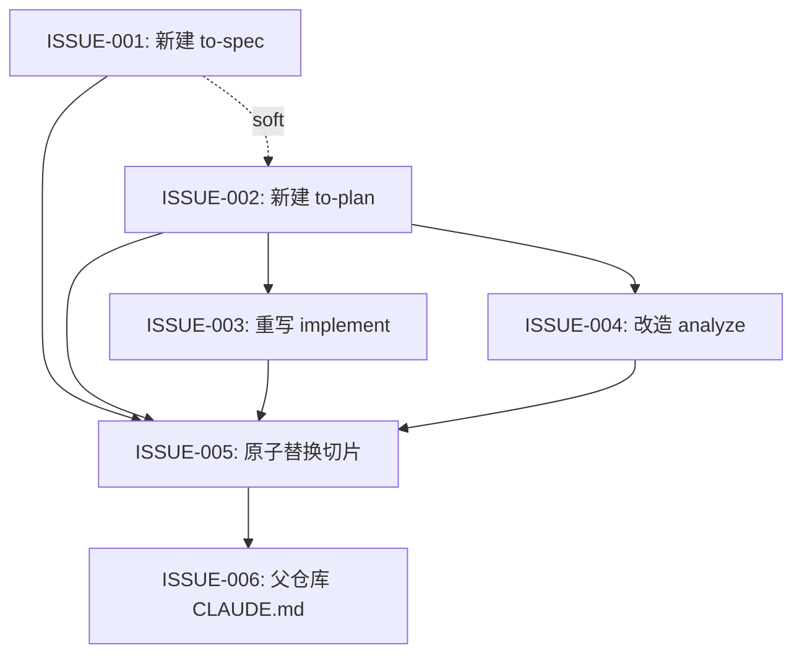

# Spec-Plan Workflow 替换 PRD-Issues 工作流 Issues

## 元数据 (Metadata)

- **Source**: `docs/features/spec-plan-workflow/prd.md`
- **Generated at**: 2026-07-03
- **Status**: Draft

## 假设 (Assumptions)

- 拆分已经用户确认（2026-07-03 会话）。
- 相对 PRD Handoff Notes 的调整：FR-013（README/AGENTS 更新）从独立切片并入 ISSUE-005 原子切片，因为 validator 的 stale-text 检查会扫描 `README.md`/`AGENTS.md`，分开提交必然导致校验中断；ISSUE-006 只保留父仓库 `CLAUDE.md`（FR-017）。
- 本次拆分是 `to-issues` 的最后一次执行；Wave/Parallelization 字段按现行契约填写，但执行建议全部为 inline 串行。

## 需求覆盖 (Requirement Coverage)

| Requirement | Issues | Verification seam | Notes |
| --- | --- | --- | --- |
| FR-001 | ISSUE-001 | `validate-skills.py` + 人工 review spec 模板 | to-spec skill 骨架与产物路径 |
| FR-002 | ISSUE-001 | 人工试跑产出 spec.md 核对字段 | 叙事结构 + FR/SC 稳定 ID |
| FR-003 | ISSUE-002 | `validate-skills.py` + 人工 review plan 模板 | to-plan skill 骨架与单文件产物 |
| FR-004 | ISSUE-002 | 人工试跑产出 plan.md 核对 task 字段 | 文件路径 / Consumes/Produces / Covers / 验收 / 验证命令 |
| FR-005 | ISSUE-002 | 人工试跑核对：无代码、无并行字段、有 coverage 自查表 | 负向约束写入 SKILL.md 验证清单 |
| FR-006 | ISSUE-005 | `grep -r "to-prd\|to-issues"` 零命中（历史产物除外） | 删除目录 + 活引用清零 |
| FR-007 | ISSUE-005 | 人工核对路由表唯一入口（SC-003） | workflow-router 更新 |
| FR-008 | ISSUE-005 | `validate-skills.py` | brainstorming SKILL.md + openai.yaml |
| FR-009 | ISSUE-005 | `validate-skills.py`（GRILL_ME_REQUIRED_TEXT 新常量） | grill-me Natural Handoff |
| FR-010 | ISSUE-005 | `validate-skills.py` + grep | quick-change 升级链路 |
| FR-011 | ISSUE-003 | 人工 review 决策树无 issue/wave 残留语义 | implement 系统性重写 |
| FR-012 | ISSUE-004 | 人工 review 检查项与报告模板一致 | analyze 改造 |
| FR-013 | ISSUE-005 | `validate-skills.py`（README/AGENTS 契约文本检查） | 并入原子切片，见 Assumptions |
| FR-014 | ISSUE-005 | `validate-skills.py` 自身跑通且新增 stale-text 生效 | validator 常量与检查目标 |
| FR-015 | ISSUE-001, ISSUE-002 | `validate-skills.py`（openai.yaml 字段与语言契约 marker） | 新 skill 元数据 |
| FR-016 | ISSUE-001, ISSUE-002 | 人工试跑核对 manifest 产物行 | manifest 职责移交 |
| FR-017 | ISSUE-006 | 人工 review 父仓库 CLAUDE.md | 跨 repo，单独提交 |
| SC-001 | ISSUE-005 | `python scripts/validate-skills.py` 退出码 0 | 最终验收 |
| SC-002 | ISSUE-005 | 仓库级 grep 残留检查 | 最终验收 |
| SC-003 | ISSUE-005 | 路由表人工核对 | 最终验收 |
| SC-004 | ISSUE-002 完成后独立执行 | 真实需求试跑 `to-spec -> to-plan` | 写入 ISSUE-002 Testing Notes |
| SC-005 | 不进 coverage | post-launch metric | 日常使用观察 |

## 依赖图 (Dependency Graph)

## 执行波次 (Execution Waves)

| Wave | Issues | Parallel guidance |
| --- | --- | --- |
| 1 | ISSUE-001, ISSUE-002 | 建议串行（001 先行）；两者共享模板字段与 handoff 措辞约定 |
| 2 | ISSUE-003, ISSUE-004 | 文件不相交，可并行，但均需 002 的 plan 模板定稿；建议 inline 串行 |
| 3 | ISSUE-005 | 单切片原子提交，结束时 validator 必须全绿 |
| 4 | ISSUE-006 | 父仓库单独提交（含 submodule 指针更新） |

## Subagent 执行指引 (Subagent Execution Guidance)

- 不建议 subagent 并行落地：ISSUE-001/002 是同一对模板契约的两半，ISSUE-005 是跨 8+ 文件的互锁原子改动；本次改造本身就在移除并行机制，全程 inline 串行成本最低。
- 共享 contracts：spec/plan 模板字段名（`FR-###`、`Covers`、`Consumes/Produces`）、validator 常量（`GRILL_ME_REQUIRED_TEXT`、stale-text 列表）、Natural Handoff 契约文本（README/AGENTS/workflow-router 三处互锁）。
- human-gate：ISSUE-001/002 的 description 措辞、ISSUE-003 的决策树重写结果需要用户过目（对应 PRD Open Question 与 Risk）。

## Issue 索引 (Issue Index)

| ID | Title | Type | Covers | Parallelization | Wave | Depends on | File |
| --- | --- | --- | --- | --- | --- | --- | --- |
| ISSUE-001 | 新建 `to-spec` skill | HITL | FR-001, FR-002, FR-015, FR-016 | coordination-needed | 1 | None | [01-create-to-spec-skill.md](01-create-to-spec-skill.md) |
| ISSUE-002 | 新建 `to-plan` skill | HITL | FR-003, FR-004, FR-005, FR-015, FR-016 | coordination-needed | 1 | ISSUE-001 (soft) | [02-create-to-plan-skill.md](02-create-to-plan-skill.md) |
| ISSUE-003 | 重写 `implement` 决策树 | HITL | FR-011 | parallel-safe | 2 | ISSUE-002 (hard) | [03-rewrite-implement-decision-tree.md](03-rewrite-implement-decision-tree.md) |
| ISSUE-004 | 改造 `analyze` coverage 检查 | AFK | FR-012 | parallel-safe | 2 | ISSUE-002 (hard) | [04-rework-analyze-coverage.md](04-rework-analyze-coverage.md) |
| ISSUE-005 | 原子替换切片 | AFK | FR-006~FR-010, FR-013, FR-014 | sequential | 3 | ISSUE-001~004 (hard) | [05-atomic-swap-remove-old-skills.md](05-atomic-swap-remove-old-skills.md) |
| ISSUE-006 | 更新父仓库 `CLAUDE.md` | AFK | FR-017 | sequential | 4 | ISSUE-005 (hard) | [06-update-parent-claude-md.md](06-update-parent-claude-md.md) |
