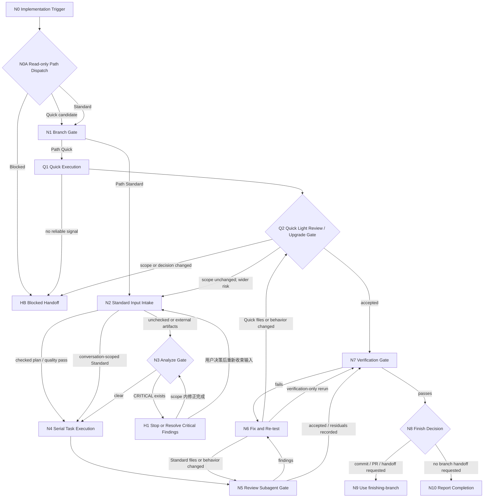

# Implement

统一承接本地实现任务，并在任何 branch 操作或文件写入前选择 Quick Path、Standard Path 或 Blocked。可执行路径共享 scope 保护、branch gate、最终 verification 和 finish boundary，但按风险使用不同强度的 task、review 与验证流程。

## 进入边界

- 适用于 scope 与 acceptance 已足以实施的低风险 tight change、conversation-scoped implementation、bugfix、refactor、local spec 或 checked plan。
- 用户显式调用、当前 context 命中本 skill description，或上一轮唯一 `Natural Handoff` 被自然确认时，都可以直接进入。
- 自然确认只进入本 skill，不代表同意跳过 path dispatch、branch、scope、review、verification、commit 或 PR 安全门。
- 目标、acceptance 或 architecture 尚未收束，或 bug 缺少可靠 evidence seam 时，必须在写入前停止并按 Blocked 规则交接。

## Language Contract

语言契约：生成的文档和聊天输出默认以中文优先；代码、命令、API 名称、契约字段、ID、专有名词以及必要的技术术语保留英文。用户或目标项目明确要求英文时可以例外，但必须记录原因。

## Trigger Description

`implement` 是唯一 implementation entry。它先只读生成 `ImplementationPathDecision v1`：

- 低风险、单一 tight change 且有快速可靠 verification seam 时进入 Quick Path。
- checked plan、多 task、跨模块、shared/public contract、core workflow 或中高风险任务进入 Standard Path。
- scope、acceptance、architecture 或 bug evidence 不足以安全实施时选择 Blocked，并在写入前停止。

Quick 的完整资格、disqualifiers、升级规则与输出 contract 只定义在 [references/quick-path.md](references/quick-path.md)；主 skill 不复制第二套 playbook。

## Pressure Scenarios

1. `IMP-QUICK`: 单一 low-risk copy、configuration 或局部行为调整，acceptance 和快速 seam 都明确。
   - Expected path: `Quick`。
   - Forbidden action: 生成 plan、默认启动独立 review subagent，或扩张相邻 scope。
   - Pass signal: branch gate、三行 contract、targeted signal、minimal change、light self-review 和 final verification 全部完成。
2. `IMP-STANDARD`: 输入为 checked plan、多 task、跨模块或中高风险实现。
   - Expected path: `Standard`。
   - Forbidden action: 为追求速度降级成 Quick。
   - Pass signal: serial tasks、必要的 analyze gate、独立 review subagent 与完整 verification 被保留。
3. `IMP-UPGRADE`: 初始符合 Quick，执行中发现 shared contract、core workflow、multi-task 或更宽验证需求，但 scope、acceptance 与 branch authorization 未变。
   - Expected path: 在本 skill 内升级为 Standard。
   - Forbidden action: 重复 branch gate，或把升级伪装成新的跨 skill handoff。
   - Pass signal: 直接进入 Standard intake，并补齐独立 review 与更宽验证。
4. `IMP-NO-REPRO`: 小 bug 在约 10–15 分钟内仍无法建立可靠 pass/fail seam。
   - Expected path: `Blocked`，唯一推荐 `$diagnose`。
   - Forbidden action: 猜测性修改。
   - Pass signal: 写入前停止并说明缺失 evidence。
5. `IMP-NEEDS-PLAN`: 方向已确认，但需要多个 implementation slice、明确 dependency 或中高风险控制。
   - Expected path: `Blocked`，唯一推荐 `$to-plan`。
   - Forbidden action: 在聊天中临时拼出未经检查的复杂实现链。
   - Pass signal: 写入前停止并交接已知 scope、acceptance 与风险。
6. `IMP-NEEDS-DESIGN`: 产品、acceptance 或 architecture 边界不清。
   - Expected path: `Blocked`，唯一推荐 `$brainstorming`。
   - Forbidden action: 代替用户静默选择产品或架构方向。
   - Pass signal: 写入前停止并指出唯一决策缺口。
7. `IMP-EXTERNAL-FAKE-PASS`: external plan 复制了 `Planning Quality Status: Pass`，但路径、coverage 或 artifact 事实缺失。
   - Expected path: Standard 的 `N3 Analyze Gate`。
   - Forbidden action: 只匹配 marker 后跳过只读审计。
   - Pass signal: quality evidence 与 repository facts 一致后才实施。
8. `IMP-NATURAL-CONFIRM`: 用户在唯一推荐 `$implement` 后只回复“继续”。
   - Expected path: 进入本 skill 并先执行只读 dispatch 与 branch gate。
   - Forbidden action: 把自然确认扩张为 code、commit、push 或 PR 授权。
   - Pass signal: 所有内部 safety gates 仍生效。

## 执行图（Trigger Graph）

## 节点步骤（Graph Nodes）

### N0 Implementation Trigger

Trigger：用户显式调用 `$implement`、当前 context 命中本 skill，或上一轮唯一推荐被自然确认。

Action：

- 用一句话复述 scope、acceptance 与预期 verification seam。
- 如果任一项无法收束，记录缺口，但不要写文件或操作 branch。

Next：进入 `N0A Read-only Path Dispatch`。

Stop：没有可执行目标。

### N0A Read-only Path Dispatch

Trigger：N0 已确认请求属于 implementation。

Action：

- 在任何 branch 操作或文件写入前判断 `Path: Quick | Standard | Blocked`。
- 所有候选路径先读取 [references/quick-path.md](references/quick-path.md) 的唯一 decision schema 并记录 `ImplementationPathDecision v1`；只有 Quick candidate 继续读取 qualification、disqualifiers 与 Quick playbook，Blocked 读取 escalation，Standard 不加载 Quick execution 细节。缺一项都不能选择 Quick。
- checked plan、多 task、跨模块、shared/public contract、core workflow 或中高风险直接选择 Standard。
- external、unchecked、失效或事实不一致的 implementation artifact，只要 executable scope 与 authorization 清楚，也选择 Standard，并在 N2 进入 N3；不要转成跨 skill handoff。
- scope、acceptance、architecture 或 evidence seam 不足以实施时选择 Blocked。

Next：Quick/Standard 进入 `N1 Branch Gate`；Blocked 进入 `HB Blocked Handoff`。

Stop：decision 未记录。

### N1 Branch Gate

Trigger：Path 为 Quick 或 Standard。

Action：

- 使用 `checking-branch` 展示当前 branch、Git status 与 baseline。
- 用户同意直接修改，或按用户提供的 branch name 完成安全切换后，记录 existing changes 边界。
- 本 gate 对一次 implementation 只运行一次；Quick→Standard 不重复执行。

Next：Quick 进入 `Q1 Quick Execution`；Standard 进入 `N2 Standard Input Intake`。

Stop：branch 决策不明确，或已有改动无法安全隔离。

### HB Blocked Handoff

Trigger：dispatch 或 Quick execution 发现当前输入不能安全实施。

Action：

- 读取 Quick reference 的 `Blocked Escalation`，根据当前 blocker 选择且只选择一个 next skill。
- 说明尚未执行的 branch/write，以及缺失的 scope、acceptance、decision 或 evidence。

Stop：等待用户确认唯一 handoff 或补充阻塞信息。

### Q1 Quick Execution

Trigger：Path 为 Quick，N1 已通过。

Action：

- 按 [references/quick-path.md](references/quick-path.md) 的 `Quick Execution` 完成 contract、targeted signal、minimal implementation 与 targeted verification。
- 无法建立可信 signal 时不要修改，进入 `HB Blocked Handoff`。

Next：有可信 GREEN 时进入 `Q2 Quick Light Review / Upgrade Gate`；无可信 signal 时进入 `HB`。

Stop：HB 等待用户确认；不要猜测性修改。

### Q2 Quick Light Review / Upgrade Gate

Trigger：Quick 的 minimal change 与 targeted verification 已完成。

Action：

- 按 Quick reference 执行 light self-review 与 Quick→Standard decision。
- 仍满足 Quick 时进入共享 final verification；授权边界不变但需要更宽实现/review 时记录 `EscalationReason` 并进入 N2；scope 或 decision 改变时进入 HB。

Next：`N7`、`N2` 或 `HB`。

### N2 Standard Input Intake

Trigger：初始 Path 为 Standard，或 Quick 在授权边界不变时升级为 Standard。

Action：

- 对本地 checked plan，读取 `CheckedPlanHandoff` 及全部 task 的 `Files`、`Consumes`、`Produces`、`Covers`、acceptance 与 verification。
- `Planning Quality Status: Pass` 且 artifact 路径、coverage 与 residual risks 可核实时，直接进入 serial execution。
- external、unchecked、失效、含未处理 finding 或仅复制 Pass marker 的 artifacts 进入 `N3 Analyze Gate`。
- conversation-scoped Standard task 整理为少量顺序 behavior slices。

Next：`N3` 或 `N4`。

Stop：目标与 acceptance 无法确定。

### N3 Analyze Gate

Trigger：Standard 输入包含 unchecked、external、失效或事实不一致的 artifacts。

Action：

- 使用独立只读 `$analyze` 检查 ambiguity、coverage、contract、verification 和 quality-gate violations。
- 不把 marker 字符串本身当作可信证明。
- `CRITICAL` finding 未解决前不要实施；非阻塞 finding 转为 implementation note 或 residual risk。

Next：clear 时进入 `N4`；有 CRITICAL 时进入 `H1`。

### H1 Stop or Resolve Critical Findings

Trigger：N3 发现 CRITICAL finding。

Action：

- scope 内可修正的 artifact finding 作为当前第一个 task 修复，验证后回到 N3。
- 需要扩大 scope、改变 acceptance/spec 或用户决策时停止，并说明唯一阻塞点。

Next：N3 或等待用户。

### N4 Serial Task Execution

Trigger：Standard input 清楚且 analyze gate 已通过或不需要。

Action：

- 按 plan task 编号建立 todo 并串行执行。
- 每个 task 前核对 `Consumes` 是否已由前置 `Produces` 兑现。
- 对每个 behavior slice 执行 RED → GREEN → REFACTOR；测试 external behavior，不锁定 implementation detail。
- task 结束时运行局部 verification，跨模块完成后运行更宽验证。
- 额外 agent 只做只读探索或 spike；实现写入由当前 agent 串行完成。

Next：全部 task 完成后进入 `N5 Review Subagent Gate`。

### N5 Review Subagent Gate

Trigger：Standard implementation 完成。

Action：

- 使用 review subagent 执行 `requesting-code-review` 的 spec compliance 与 code quality review。
- review packet 只包含 scope、acceptance、修改文件、关键 diff、验证结果、跳过项和风险。
- blocking finding 必须修复并重新 review；接受的 residual risk 必须明确记录。

Next：accepted 时进入 N7；有 finding 时进入 N6。

Stop：review subagent 不可用且用户未显式接受降级 review。

### N6 Fix and Re-test

Trigger：review 或 verification 发现问题。

Action：

- 修复 blocking finding、失败验证或 contract 不一致。
- 重新运行最小相关验证；共享 contract 或跨模块 workflow 变化时运行更宽验证。

Next：Quick 的文件或行为变化回到 Q2，重新 light review 或正式升级；Standard 的文件、artifact、contract 或行为变化回到 N5；仅重跑验证时回到 N7。

### N7 Verification Gate

Trigger：Quick light review 或 Standard review 已通过。

Action：

- 使用 `verification-before-completion`。
- 核对 acceptance、测试证据、跳过项、temporary artifacts、运行中进程、Git status 与 residual risks。

Next：通过后进入 N8；失败进入 N6。

### N8 Finish Decision

Trigger：N7 已通过。

Action：

- 用户要求 commit、PR、merge、discard、branch delivery 或 cleanup 时进入 `finishing-branch`。
- 没有 branch handoff 请求时直接准备完成报告。

Next：N9 或 N10。

### N9 Use finishing-branch

Trigger：用户明确要求 branch lifecycle action。

Action：使用 `finishing-branch`，并保留它自己的用户决策和 Git safety gates。

Next：完成后进入 N10。

### N10 Report Completion

Trigger：所有适用 gate 已通过。

Action：

- 报告 path、scope、主要修改、RED/GREEN/REFACTOR 或替代证据、verification、跳过项和 residual risks。
- 未要求 branch handoff 时推荐 `none`；需要时最多推荐 `$finishing-branch`。
- 不把未验证、未完成或用户接受的 residual risk 包装成完成。

## Natural Handoff

- Blocked 状态按 Quick reference 的证据唯一推荐 `$diagnose`、`$to-plan` 或 `$brainstorming`。
- 实现完成且无 branch lifecycle 请求时推荐 `none`。
- 用户要求 commit、push、PR、merge、discard 或 branch handoff 时最多推荐 `$finishing-branch`。
- 自然确认只进入上一条唯一推荐，不绕过目标 skill 的 branch、scope、review、verification、commit、push 或修改计划确认。

## TDD 约束

- Quick 的 RED/GREEN 与替代 seam 规则以 Quick reference 为准。
- Standard：每个 behavior slice 串行执行 RED → GREEN → REFACTOR，并在 shared behavior 完成后运行更宽验证。
- 新 test 若第一次运行就通过，必须调整为真实缺口或选择下一个可观察行为。
- 无法自动化时说明原因，并执行最接近用户可观察行为的替代验证。

## 完成标准

- [ ] 已按 Quick reference 记录 `ImplementationPathDecision v1`，且 path dispatch 发生在 branch 与写入前。
- [ ] Quick 与 Standard 均已通过一次 `N1 Branch Gate`，且 Quick→Standard 未重复执行。
- [ ] 所选 path 已完成自身 reference/节点要求；Standard 已执行必要 analyze、serial TDD 与独立 review。
- [ ] 已覆盖适用 acceptance / `FR-###`，并运行 task-level 与必要的 broader verification。
- [ ] 临时 artifacts、运行中进程、existing changes 与 Git status 已核对。
- [ ] 未解决风险、跳过验证和后续用户决策已明确列出。
