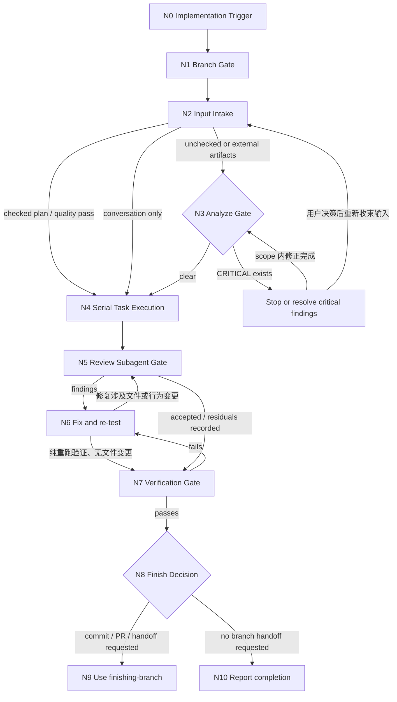

# Implement

把实现任务推进到可交付状态。这个 skill 按 trigger graph 执行：每一步都有进入条件、动作、下一跳和停止条件，agent 应按当前状态逐步推进，而不是凭直觉跳过 gate。

## 进入边界

- 适用于已经有可执行 scope、plan、spec 或 conversation-scoped coding task 的实现任务。
- 可以由用户显式调用，也可以由 `workflow-router` 或上一轮 `Natural Handoff` 推荐后进入。
- 自然确认只进入本 skill，不代表同意跳过 branch、scope、review、verification、commit 或 PR 安全门。

## Language Contract

语言契约：生成的文档和聊天输出默认以中文优先；代码、命令、API 名称、契约字段、ID、专有名词以及必要的技术术语保留英文。用户或目标项目明确要求英文时可以例外，但必须记录原因。

## Trigger Description

`implement` 的 trigger 是已有可执行 scope，需要完成代码/测试或其他本地实现。它优先消费可信 checked plan；未检查、失效或 external artifacts 才进入条件式 `$analyze`，随后仍按 branch、TDD、review 和 verification gates 串行推进。

## Pressure Scenarios

1. A checked plan includes `Planning Quality Status: Pass`.
   - Expected skill trigger: 读取 `CheckedPlanHandoff` 与 tasks，不重复运行独立 analysis。
   - Common failure without skill: 固定重跑 `$analyze`，增加无价值阶段。
   - Behavior this skill must force: 直接进入 branch 后的 serial task execution。
2. An external plan contains a copied `Pass` marker but missing paths or coverage.
   - Expected skill trigger: 把它视为未检查 artifacts，进入只读 `$analyze` gate。
   - Common failure without skill: 只匹配字符串并跳过质量检查。
   - Behavior this skill must force: quality evidence 必须与文件事实一致。
3. The user naturally confirms `$implement` after planning.
   - Expected skill trigger: 先执行 `checking-branch`。
   - Common failure without skill: 把 planning 授权扩张成 branch、code 或 Git 授权。
   - Behavior this skill must force: 保留全部 implementation safety gates。

## 执行图（Trigger Graph）

## 节点步骤（Graph Nodes）

### N0 Implementation Trigger

Trigger：用户明确调用 `implement`、`Implement`、`$implement`、“使用实现 skill”，或上一轮 `Natural Handoff` 唯一推荐本 skill 且用户自然确认。

Action：
- 复述本次 scope、已知 acceptance criteria 和可验证输出。
- 如果 scope 不足以实现，最多问一个阻塞问题，并给出推荐默认答案。

Next：进入 `N1 Branch Gate`。

Stop：没有可执行目标、scope 无法收束，或需要先生成 spec/plan/analysis artifacts。

### N1 Branch Gate

Trigger：`N0` 已确认这是一次实现任务。

Action：
- 使用 `checking-branch` 展示当前分支状态。
- 确认用户同意直接修改当前分支，或按用户提供的新分支名完成切换。
- 记录 baseline 是否运行、是否通过、跳过原因和已有改动边界。

Next：分支决策明确后进入 `N2 Input Intake`。

Stop：用户既不同意直接修改，也没有提供新分支名；或无法安全确认分支来源。

### N2 Input Intake

Trigger：分支 gate 已通过。

Action：
- 如果用户指定 plan 文件（默认 `docs/features/<feature-slug>/plan.md`），读取全部 task，提取每个 task 的 `Files`、`Consumes/Produces`、`Covers`、验收标准和验证命令；task 编号即执行顺序。
- 如果输入包含 `CheckedPlanHandoff`，同时读取并核对 `Planning Mode`、`ArtifactPaths`、`Coverage`、`Planning Quality Status`、`AutoFixSummary`、`Assumptions` 和 `ResidualRisks`。这些字段是 planning 质量证据，不是 branch 或实现授权。
- 如果用户指定 spec 而没有 plan，读取完整 artifact，轻量检查相关代码、测试和 supporting docs；scope 超过一次可控实现时，建议用户显式调用 `$to-plan`，用户要求直接做时自行整理成少量顺序 task。
- 如果只有 conversation context，整理目标、约束、验收和可观察行为，形成少量可执行 task。

Next：
- 本地 checked plan 明确包含 `Planning Quality Status: Pass`，且 artifact 路径、coverage 和 residual risks 可读取时，直接进入 `N4 Serial Task Execution`。
- 缺少 quality status、状态为 `Decision required`、存在未处理 finding、quality evidence 与文件事实不一致，或输入属于未检查的 external artifacts 时，进入 `N3 Analyze Gate`。
- 没有 artifacts 时直接进入 `N4 Serial Task Execution`。

Stop：输入目标与验收都无法确定，且一个阻塞问题仍不能消除歧义。

### N3 Analyze Gate

Trigger：存在未检查/失效的 spec、plan、external artifacts，或已提供的 `analyze` 结果；有效 checked plan 不重复进入本节点。

Action：
- 对缺少 `Planning Quality Status: Pass`、状态失败、包含未处理 finding 或来自 external artifacts 的输入，优先运行或读取独立只读 `$analyze` 结果。
- 不把 marker 字符串本身当作可信证明：如果 checked plan 引用路径不存在、coverage 缺失、artifacts 在 quality gate 后发生实质修改，按未检查输入处理。
- `CRITICAL` finding 未解决前不要开始实现。
- 非阻塞 finding 转成 implementation note、risk 或 follow-up，并在最终报告中保留。

Next：没有未处理 `CRITICAL` finding 后进入 `N4 Serial Task Execution`。

Stop：`CRITICAL` finding 阻塞实现，且无法在当前任务内修正或需要用户决策。

### H1 Stop or Resolve Critical Findings

Trigger：`N3 Analyze Gate` 发现 `CRITICAL` finding。

Action：
- 先判断该 finding 是否属于当前实现 scope 内可直接修正的问题。
- 可修正时，把它转成当前实现的第一个 task，修复并验证后回到 `N3 Analyze Gate`。
- 需要用户决策、扩大 scope、修订 spec/plan 或改变 acceptance criteria 时停止实现，说明阻塞点和推荐决策。

Next：scope 内修正完成后回到 `N3 Analyze Gate`；用户决策后根据新输入重新进入 `N2 Input Intake`。

Stop：`CRITICAL` finding 仍未解决，或用户尚未确认会改变 scope / acceptance criteria 的决策。

### N4 Serial Task Execution

Trigger：输入清楚，analyze gate 已通过或无 artifacts。

Action：
- 建立 todo：按 plan task 编号（或整理出的顺序 task）列出任务，逐个串行执行。
- 执行每个 task 前核对其 `Consumes` 契约是否已由前置 task 的 `Produces` 兑现；发现契约与代码事实不符时，记录冲突和推荐修正，只有阻塞实现时才问用户。
- 对每个 task 执行 TDD：RED 写一个外部可观察行为的失败测试或等价 repro；GREEN 写最小实现；REFACTOR 只在全绿后清理命名、重复和结构。
- 每个 task 结束时运行该 task 的验证命令；跨模块行为完成后运行更宽验证。
- 需要额外上下文时，可以让 subagent 做只读探索或 spike；探索结果由当前 agent 消化，实现始终由当前 agent 串行完成，不把写入工作分派给 subagent。

Next：全部 task 完成后进入 `N5 Review Subagent Gate`。

Stop：没有可验证 task、测试环境完全不可用且没有可替代静态或手动验证路径。

### N5 Review Subagent Gate

Trigger：实现完成，尚未声明完成。

Action：
- 使用 review subagent 执行 `requesting-code-review` 的 spec compliance 和 code quality review；coordinator 不要自己替代 review subagent。
- 只给 review subagent 必要上下文：用户原始要求或相关 spec/plan task 摘要、acceptance criteria、scope 边界、修改文件列表、关键 diff、测试/验证命令与结果、已知跳过项和风险。
- 不要把完整 conversation、无关 artifacts、全仓库文件、未筛选日志或 coordinator 的内部推理交给 review subagent。
- 如果改动跨多个独立 task，可按 task 拆分 review packet；共享 contract、schema、public interface 或跨模块 workflow 需要额外给出最小共享上下文。
- review subagent finding 必须修复并重新运行相关验证；如果用户决定接受残留风险，记录 finding、影响和用户决策。

Next：review 通过或残留风险明确后进入 `N7 Verification Gate`。

Stop：review subagent 工具不可用、review packet 无法最小化、或存在未处理的阻塞级 finding。

Fallback：
- 如果 review subagent 工具不可用，停止声明完成，并向用户给出一个明确选择：安装或启用可用 review agent、等待人工 review、或显式接受记录为 residual risk 的降级 review。
- 不要把 coordinator 自己的快速复查包装成 `requesting-code-review` 已完成。

### N6 Fix and re-test

Trigger：`N5 Review Subagent Gate` 或 `N7 Verification Gate` 发现问题。

Action：
- 修复 blocking finding、失败测试、artifact 不一致或 verification failure。
- 重新运行最小相关验证；如果修复影响共享 contract、schema、public interface 或跨模块 workflow，运行更宽验证。
- 记录修复内容和重新验证结果。

Next：凡是修复涉及代码、artifact、contract、schema、测试或验证命令变更，都回到 `N5 Review Subagent Gate`；只有纯粹重跑验证且没有任何文件或行为变更时，才回到 `N7 Verification Gate`。

Stop：问题无法在当前任务内修复，或需要用户做 scope / risk 决策。

### N7 Verification Gate

Trigger：review gate 已通过。

Action：
- 使用 `verification-before-completion`。
- 确认 acceptance criteria、测试结果、跳过验证原因、临时文件、运行中进程、git 状态和残留风险。
- 验证失败时回到 `N6 Fix and re-test`，不要声明完成。

Next：验证通过后进入 `N8 Finish Decision`。

Stop：验证失败且无法在当前任务内修复。

### N8 Finish Decision

Trigger：verification gate 已通过。

Action：
- 如果用户要求 commit、PR、交付分支、清理分支或收尾，使用 `finishing-branch`。
- 如果没有分支交付请求，直接报告完成范围、验证证据、跳过项和残留风险。

Next：需要分支收尾时进入 `N9 Use finishing-branch`；否则进入 `N10 Report completion`。

Stop：分支交付需要用户选择且尚未选择。

### N9 Use finishing-branch

Trigger：用户要求 commit、PR、交付分支、清理分支或收尾。

Action：
- 使用 `finishing-branch`。
- 报告分支状态、commit/PR/handoff 结果、未纳入范围的改动和残留风险。

Next：分支收尾完成后进入 `N10 Report completion`。

Stop：`finishing-branch` 需要用户选择交付方式且尚未选择。

### N10 Report completion

Trigger：所有质量门已通过，且没有分支收尾阻塞。

Action：
- 用简短完成报告说明完成范围、主要修改、验证命令与结果、跳过验证、残留风险和下一步用户决策。
- 不把未完成、未验证或被用户接受的残留风险包装成完成。
- 如果用户接下来需要 commit、push、PR、merge、discard 或分支交付，最多推荐 `$finishing-branch` 作为唯一 next skill。
- 如果当前任务已经自然结束，明确推荐 `none`，不要为了链路完整性继续推荐 skill。
- 说明自然确认只进入上一条唯一推荐的 next skill，不会跳过该 skill 自己的安全门。

Next：`$finishing-branch` 或 `none`。

Stop：无。

## TDD 约束

- 测试描述 external behavior，不测试 implementation details。
- 优先通过 public interface、CLI、API、UI workflow 或 integration seam 验证。
- 一次只为一个行为写测试；不要先批量写完所有测试再实现。
- 新测试如果第一次运行就通过，说明没有证明缺失行为；调整测试或选择下一个真实缺口。
- Bugfix 必须先有复现失败的测试或等价 repro loop。
- Refactor 前必须保持测试全绿；refactor 不引入新行为。
- 如果某类变更无法自动化测试，记录原因，并执行最接近用户可观察行为的手动或静态验证。

## 完成标准

完成前确认：

- 已通过或明确降级 `checking-branch`。
- 已核对 checked plan 的 `Planning Quality Status: Pass`，或对未检查/外部 artifacts 运行独立 `$analyze` 并处理 `CRITICAL` findings。
- 已覆盖 spec `FR-###` 或 plan task 的 acceptance criteria；只有 conversation scope 时覆盖整理出的验收清单。
- 已保留每个 task 的 RED/GREEN/REFACTOR 证据，或记录无法自动化测试的替代验证。
- 已运行每个 task 的验证命令和必要的更宽验证。
- 已由 review subagent 执行 `requesting-code-review`，并记录最小 review packet 范围、findings、修复结果；如果 review subagent 工具不可用，必须记录用户显式接受的 residual risk 降级 review。
- 已通过 `verification-before-completion`。
- 已列出未解决风险、跳过测试的原因、以及需要用户后续决定的事项。
- 没有遗留正在运行的实现或验证进程。
