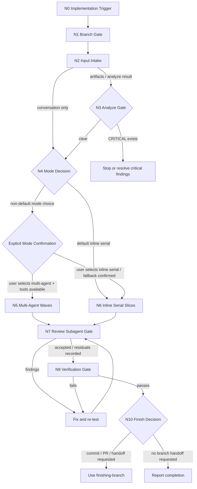

# Implement

把实现任务推进到可交付状态。这个 skill 按 trigger graph 执行：每一步都有进入条件、动作、下一跳和停止条件，agent 应按当前状态逐步推进，而不是凭直觉跳过 gate。

## 进入边界

- 适用于已经有可执行 scope、PRD、issues、plan、spec 或 conversation-scoped coding task 的实现任务。
- 可以由用户显式调用，也可以由 `workflow-router` 或上一轮 `Natural Handoff` 推荐后进入。
- 自然确认只进入本 skill，不代表同意跳过 branch、scope、mode、review、verification、commit 或 PR 安全门。

## Language Contract

语言契约：生成的文档和聊天输出默认以中文优先；代码、命令、API 名称、契约字段、ID、专有名词以及必要的技术术语保留英文。用户或目标项目明确要求英文时可以例外，但必须记录原因。

## 执行图（Trigger Graph）



## 节点步骤（Graph Nodes）

### N0 Implementation Trigger

Trigger：用户明确调用 `implement`、`Implement`、`$implement`、“使用实现 skill”，或上一轮 `Natural Handoff` 唯一推荐本 skill 且用户自然确认。

Action：
- 复述本次 scope、已知 acceptance criteria 和可验证输出。
- 如果 scope 不足以实现，最多问一个阻塞问题，并给出推荐默认答案。

Next：进入 `N1 Branch Gate`。

Stop：没有可执行目标、scope 无法收束，或需要先生成 PRD/issues/analysis artifacts。

### N1 Branch Gate

Trigger：`N0` 已确认这是一次实现任务。

Action：
- 使用 `checking-branch` 展示当前分支状态。
- 确认用户同意直接修改当前分支，或按用户提供的新分支名完成切换。
- 记录 baseline 是否运行、是否通过、跳过原因和已有改动边界。

Next：分支决策明确后进入 `N2 Input Intake`。

Stop：用户既不同意直接修改，也没有提供新分支名；或无法安全确认分支来源。

### N2 Input Intake

Trigger：分支 gate 已通过。

Action：
- 如果用户指定 issue 目录或 issue 文件，读取 `00-index.md` 和本次相关 issue，提取 dependency graph、execution waves、parallelization notes、acceptance criteria 和 verification commands。
- 如果用户指定 PRD、plan 或 spec，读取完整 artifact，轻量检查相关代码、测试和 supporting docs；scope 超过一个薄 slice 时，建议用户显式调用 `$to-issues`，用户要求直接做时自行拆成少量 vertical slices。
- 如果只有 conversation context，整理目标、约束、验收和可观察行为，形成少量可执行 slices。

Next：有 artifacts 或已有 analyze 结果时进入 `N3 Analyze Gate`；没有 artifacts 时直接进入 `N4 Mode Decision`。

Stop：输入目标与验收都无法确定，且一个阻塞问题仍不能消除歧义。

### N3 Analyze Gate

Trigger：存在 PRD、issues、plan、spec 或已提供的 `analyze` 结果。

Action：
- 优先运行或读取 `analyze` 结果。
- `CRITICAL` finding 未解决前不要开始实现。
- 非阻塞 finding 转成 implementation note、risk 或 follow-up，并在最终报告中保留。

Next：没有未处理 `CRITICAL` finding 后进入 `N4 Mode Decision`。

Stop：`CRITICAL` finding 阻塞实现，且无法在当前任务内修正或需要用户决策。

### N4 Mode Decision

Trigger：输入和 analyze gate 已清楚。

Action：
- 默认情况选择 `inline serial execution`，并直接进入 `N6 Inline Serial Slices`。默认情况包括：只有 conversation context、没有 issue dependency graph、单个薄 slice、没有可并行 wave、或用户没有要求讨论执行模式。
- 除默认情况外，只要需要在 `multi-agent parallel execution` 和 `inline serial execution` 之间做选择，必须向用户显式确认一次；不要只因为 artifacts 看起来适合并行就自行启动 multi-agent。
- 推荐 `multi-agent parallel execution` 的前提：同一 wave 内有 2 个以上 `parallel-safe` issues；没有共享 contract、schema、核心 module、同一文件写入或验证资源冲突；当前环境有可用 subagent / multi-agent 工具。
- 有依赖链、共享接口、migration、设计系统、核心 workflow 或 ownership 冲突时，推荐 `inline serial execution`，但如果这是从 issue artifacts 或用户要求并行引出的非默认模式选择，仍然需要显式确认。
- 允许 `serial with limited parallel exploration`：subagent 只做只读探索或 spike，实现仍由当前 agent 串行合并；这也属于非默认模式选择，必须经过显式确认。

确认问题只问一次：

```text
我建议采用 <multi-agent parallel execution / inline serial execution>，因为 <dependency / wave / shared ownership / tool availability reason>。
请选择执行模式：Multi-Agent 还是 Inline Serial？
```

Next：默认 `inline serial execution` 直接进入 `N6 Inline Serial Slices`；非默认模式选择在用户确认 `Multi-Agent` 且工具可用后进入 `N5 Multi-Agent Waves`，用户确认 `Inline Serial` 后进入 `N6 Inline Serial Slices`。

Stop：执行模式依赖用户选择且用户未确认。

### C1 Explicit Mode Confirmation

Trigger：`N4 Mode Decision` 判断当前不是默认 `inline serial execution`，需要在 `Multi-Agent` 和 `Inline Serial` 之间选择。

Action：
- 向用户说明推荐模式、推荐原因、并行前提、共享写入风险和工具可用性。
- 明确要求用户选择 `Multi-Agent` 或 `Inline Serial`，不要把沉默、催促或“你看着办”当成并行授权。
- 如果用户选择 `Multi-Agent` 但 subagent / multi-agent 工具不可用，说明无法实际并行，并要求用户确认是否回退到 `Inline Serial`。

Next：用户选择 `Multi-Agent` 且工具可用后进入 `N5 Multi-Agent Waves`；用户选择 `Inline Serial`，或确认从不可用的 `Multi-Agent` 回退后，进入 `N6 Inline Serial Slices`。

Stop：用户未选择执行模式，或用户选择的模式当前无法执行且未确认回退。

### N5 Multi-Agent Waves

Trigger：`C1 Explicit Mode Confirmation` 中用户选择 `Multi-Agent`，且 subagent / multi-agent 工具可用。

Action：
- coordinator 保留全局上下文：PRD、issue index、coverage、依赖图、共享 contracts、验证命令和完成标准。
- 每个 subagent 只接收对应 issue 必需的文本、相关 PRD 摘要、依赖边界和验证要求。
- 同一 wave 只并行启动 `parallel-safe` issues；`coordination-needed` issues 最多并行探索，不并行落地共享接口。
- 每个 implementation subagent 必须报告 issue ID、完成范围、covered requirements、RED/GREEN/REFACTOR 证据、修改文件、验证命令和结果、blocker 或 concern。
- 每个 wave 结束后同步依赖状态，再启动下一 wave。

Next：全部 wave 完成后进入 `N7 Review Subagent Gate`。

Stop：subagent 工具不可用、并行前提失效或出现共享写入冲突；回到 `C1 Explicit Mode Confirmation`，要求用户确认是否回退到 `Inline Serial`。

### N6 Inline Serial Slices

Trigger：默认 `inline serial execution`，或 `C1 Explicit Mode Confirmation` 后用户选择 / 确认回退到 `Inline Serial`。

Action：
- 建立 todo：按 issue、requirement 或可验证 slice 列出任务。
- 对每个 slice 执行 TDD：RED 写一个外部可观察行为的失败测试或等价 repro；GREEN 写最小实现；REFACTOR 只在全绿后清理命名、重复和结构。
- 每个 slice 结束时运行相关测试；跨模块行为完成后运行更宽验证。
- 遇到 artifact 与代码事实冲突时，记录冲突和推荐修正；只有阻塞实现时才问用户。

Next：全部 slices 完成后进入 `N7 Review Subagent Gate`。

Stop：没有可验证 slice、测试环境完全不可用且没有可替代静态或手动验证路径。

### N7 Review Subagent Gate

Trigger：实现完成，尚未声明完成。

Action：
- 使用 review subagent 执行 `requesting-code-review` 的 spec compliance 和 code quality review；coordinator 不要自己替代 review subagent。
- 只给 review subagent 必要上下文：用户原始要求或相关 PRD/issue 摘要、acceptance criteria、scope 边界、修改文件列表、关键 diff、测试/验证命令与结果、已知跳过项和风险。
- 不要把完整 conversation、无关 artifacts、全仓库文件、未筛选日志或 coordinator 的内部推理交给 review subagent。
- 如果改动跨多个独立 issue / slice，可按 issue / slice 拆分 review packet；共享 contract、schema、public interface 或跨模块 workflow 需要额外给出最小共享上下文。
- review subagent finding 必须修复并重新运行相关验证；如果用户决定接受残留风险，记录 finding、影响和用户决策。

Next：review 通过或残留风险明确后进入 `N9 Verification Gate`。

Stop：review subagent 工具不可用、review packet 无法最小化、或存在未处理的阻塞级 finding。

Fallback：
- 如果 review subagent 工具不可用，停止声明完成，并向用户给出一个明确选择：安装或启用可用 review agent、等待人工 review、或显式接受记录为 residual risk 的降级 review。
- 不要把 coordinator 自己的快速复查包装成 `requesting-code-review` 已完成。

### N8 Fix and re-test

Trigger：`N7 Review Subagent Gate` 或 `N9 Verification Gate` 发现问题。

Action：
- 修复 blocking finding、失败测试、artifact 不一致或 verification failure。
- 重新运行最小相关验证；如果修复影响共享 contract、schema、public interface 或跨模块 workflow，运行更宽验证。
- 记录修复内容和重新验证结果。

Next：凡是修复涉及代码、artifact、contract、schema、测试或验证命令变更，都回到 `N7 Review Subagent Gate`；只有纯粹重跑验证且没有任何文件或行为变更时，才回到 `N9 Verification Gate`。

Stop：问题无法在当前任务内修复，或需要用户做 scope / risk 决策。

### N9 Verification Gate

Trigger：review gate 已通过。

Action：
- 使用 `verification-before-completion`。
- 确认 acceptance criteria、测试结果、跳过验证原因、临时文件、运行中进程、git 状态和残留风险。
- 验证失败时回到 `N8 Fix and re-test`，不要声明完成。

Next：验证通过后进入 `N10 Finish Decision`。

Stop：验证失败且无法在当前任务内修复。

### N10 Finish Decision

Trigger：verification gate 已通过。

Action：
- 如果用户要求 commit、PR、交付分支、清理分支或收尾，使用 `finishing-branch`。
- 如果没有分支交付请求，直接报告完成范围、验证证据、跳过项和残留风险。

Next：需要分支收尾时进入 `N11 Use finishing-branch`；否则进入 `N12 Report completion`。

Stop：分支交付需要用户选择且尚未选择。

### N11 Use finishing-branch

Trigger：用户要求 commit、PR、交付分支、清理分支或收尾。

Action：
- 使用 `finishing-branch`。
- 报告分支状态、commit/PR/handoff 结果、未纳入范围的改动和残留风险。

Next：分支收尾完成后进入 `N12 Report completion`。

Stop：`finishing-branch` 需要用户选择交付方式且尚未选择。

### N12 Report completion

Trigger：所有质量门已通过，且没有分支收尾阻塞。

Action：
- 用简短完成报告说明完成范围、主要修改、验证命令与结果、跳过验证、残留风险和下一步用户决策。
- 不把未完成、未验证或被用户接受的残留风险包装成完成。
- 如果用户接下来需要 commit、push、PR、merge、discard 或分支交付，最多推荐 `$finishing-branch` 作为唯一 next skill。
- 如果当前任务已经自然结束，明确推荐 `none`，不要为了链路完整性继续推荐 skill。
- 说明自然确认只进入上一条唯一推荐的 next skill，不会跳过该 skill 自己的安全门。

Next：`$finishing-branch` 或 `none`。

Stop：无。

## TDD 约束

- 测试描述 external behavior，不测试 implementation details。
- 优先通过 public interface、CLI、API、UI workflow 或 integration seam 验证。
- 一次只为一个行为写测试；不要先批量写完所有测试再实现。
- 新测试如果第一次运行就通过，说明没有证明缺失行为；调整测试或选择下一个真实缺口。
- Bugfix 必须先有复现失败的测试或等价 repro loop。
- Refactor 前必须保持测试全绿；refactor 不引入新行为。
- 如果某类变更无法自动化测试，记录原因，并执行最接近用户可观察行为的手动或静态验证。

## 完成标准

完成前确认：

- 已通过或明确降级 `checking-branch`。
- 已处理 artifacts 中的 `CRITICAL` analyze findings。
- 已选择并记录执行模式：默认 `inline serial execution` 需记录默认原因；非默认模式选择需记录用户对 `Multi-Agent` 或 `Inline Serial` 的显式确认。
- 已覆盖 PRD requirements 或选定 issues 的 acceptance criteria。
- 已保留每个 slice 或 issue 的 RED/GREEN/REFACTOR 证据，或记录无法自动化测试的替代验证。
- 已运行相关测试和必要的更宽验证。
- 已由 review subagent 执行 `requesting-code-review`，并记录最小 review packet 范围、findings、修复结果或用户接受的残留风险。
- 已通过 `verification-before-completion`。
- 已列出未解决风险、跳过测试的原因、以及需要用户后续决定的事项。
- 没有遗留正在运行的实现或验证进程。
