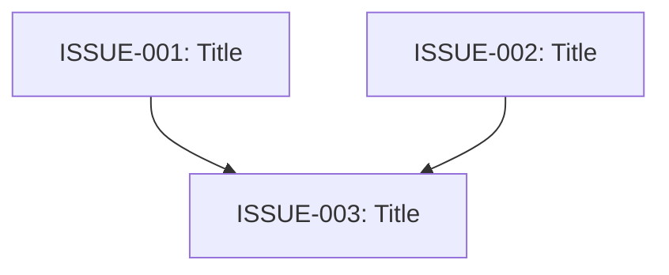

# To Issues

将 plan、spec、PRD 或当前 conversation context 拆成可独立领取的本地 issues。每个 issue 都应该是一条 tracer-bullet vertical slice，能端到端交付一小段完整行为。

## 输出约定

- 只生成本地 Markdown 文档，不创建任何远端 issue。
- 不依赖任何外部 setup、远端标签配置、远端 tracker 配置或其他 skill。
- 如果用户指定输出目录，写入该目录。
- 如果用户没有指定输出目录，使用 `docs/issues/<feature-slug>/`。
- 创建一个 `00-index.md` 汇总依赖、执行波次和并行建议。
- 为每个 issue 创建一个编号文件：`01-<slug>.md`、`02-<slug>.md`，依此类推。
- issue ID 使用本地稳定编号：`ISSUE-001`、`ISSUE-002`，不要使用远端编号。

## Process

### 1. 收集上下文

优先使用 conversation context 中已有的信息。如果用户给出本地 PRD、plan 或 spec 路径，读取该文件的完整内容。

如果还没有探索 codebase，做一次轻量探索来理解当前状态。Issue titles 和 descriptions 应使用项目已有的 domain vocabulary，并尊重相关 ADRs。缺少 domain docs 或 ADRs 时继续执行，不要要求外部配置。

### 2. 拆成 vertical slices

将计划拆成 **tracer bullet** issues。每个 issue 都是一条薄的 vertical slice，端到端穿过需要的 integration layers，例如 schema、API、UI、tests，而不是某一层的 horizontal slice。

拆分规则：

- 每个 slice 交付一条狭窄但完整的用户或系统行为路径。
- 完成后的 slice 必须可以单独 demo、verify 或 test。
- 优先拆成多个薄 slices，而不是少数几个厚 slices。
- 避免把纯 setup、纯 schema、纯 UI、纯 cleanup 单独作为 AFK issue，除非它本身就是可验证交付物或明确的 blocker。
- 如果某个 slice 需要人类做产品、架构或设计决策，标记为 `HITL`；否则优先标记为 `AFK`。

### 3. 明确依赖关系

为每个 issue 指定依赖。依赖必须使用本地 issue ID。

依赖类型：

- `hard`: 前置 issue 不完成，本 issue 不能开始。
- `soft`: 可以提前探索或准备，但最终实现/合并需要前置 issue 的结果。
- `human-gate`: 需要用户、designer、maintainer 或 architect 确认后才能继续。

检查 dependency graph：

- 不允许出现 cycle；如果出现 cycle，合并或重新拆分相关 issues。
- 每个 dependency 都要写原因，不要只列 ID。
- 明确 `Depends on` 和 `Unblocks`，让后续 agent 能从任一 issue 看懂上下游。

### 4. 给出并行执行指引

为后续是否由多个 subagents 并行执行提供明确建议。不要实际启动 subagents，除非用户另外要求。

为每个 issue 标记 `Parallelization`：

- `parallel-safe`: 可与同一 wave 中其他 `parallel-safe` issue 并行执行，没有 hard dependency，也没有明显共享写入冲突。
- `coordination-needed`: 可以并行探索或部分实现，但涉及共享 contract、schema、核心 module、设计语言或 migration，需要定期同步。
- `sequential`: 不建议并行；依赖前置结果，或与其他 issue 有高概率冲突。
- `human-gate`: 需要人类确认，不能作为 AFK subagent 任务直接执行。

生成 execution waves：

- `Wave 0`: 没有 hard dependency 且不需要 human-gate 的 issues。
- `Wave N`: 所有 hard dependencies 都位于更早 wave 的 issues。
- 同一 wave 内只有 `parallel-safe` issues 可以直接分配给多个 subagents。
- 同一 wave 内的 `coordination-needed` issues 可以并行，但必须在 index 中写清楚 shared ownership 和同步点。
- 如果两个 issues 会修改同一个 contract、schema、公共接口或核心 workflow，不要把它们标成无条件并行。

### 5. 先给用户确认拆分

除非用户明确要求直接写文件，否则先展示拟定拆分：

- **ID**
- **Title**
- **Type**: `AFK` / `HITL`
- **Parallelization**
- **Wave**
- **Depends on**
- **Unblocks**
- **User stories covered**，如果源材料中有 user stories

询问用户粒度、依赖和并行建议是否正确。用户确认后再写文件。

如果用户要求直接产出本地文档，直接写入文件，并在 `00-index.md` 中标记未确认的 assumptions。

### 6. 写入本地 issue 文档

写入 `00-index.md` 和每个 issue 文件。

<index-template>

# <Feature Name> Issues

## Metadata

- **Source**: <PRD path / plan path / conversation context>
- **Generated at**: <YYYY-MM-DD>
- **Status**: Draft

## Assumptions

列出拆分时使用但尚未确认的假设。没有则写 `None`。

## Dependency Graph

使用 Mermaid 画出 dependency graph。示例：

## Execution Waves

| Wave | Issues | Parallel guidance |
| --- | --- | --- |
| 0 | ISSUE-001, ISSUE-002 | 可并行；无 hard dependency |
| 1 | ISSUE-003 | 等待 ISSUE-001 和 ISSUE-002 |

## Subagent Execution Guidance

说明是否建议多个 subagents 并行执行。明确：

- 推荐并发数或不建议并发的原因
- 哪些 issues 可以同时启动
- 哪些 shared contracts、schemas、modules 或 workflows 需要同步
- 哪些 issues 必须等待 human-gate

## Issue Index

| ID | Title | Type | Parallelization | Wave | Depends on | File |
| --- | --- | --- | --- | --- | --- | --- |
| ISSUE-001 | <Title> | AFK | parallel-safe | 0 | None | `01-<slug>.md` |

</index-template>

<issue-template>

# ISSUE-<NNN>: <Title>

## Metadata

- **Type**: `AFK` / `HITL`
- **Parallelization**: `parallel-safe` / `coordination-needed` / `sequential` / `human-gate`
- **Wave**: <number>
- **Depends on**: `None` or `<ISSUE-ID> (<dependency type>: <reason>)`
- **Unblocks**: `None` or `<ISSUE-ID>`

## What to build

简洁描述这个 vertical slice 的端到端行为。描述外部可观察行为，不要写成逐层任务清单。

## Acceptance criteria

- [ ] Criterion 1
- [ ] Criterion 2
- [ ] Criterion 3

## Testing notes

说明验证该 slice 的 seam、测试类型和 prior art。只测试 external behavior，不测试 implementation details。

## Parallel execution notes

说明这个 issue 是否能交给独立 subagent。列出并行风险、需要同步的 shared ownership，以及不能并行的原因。

## Implementation notes

记录必要的 module、contract、schema、API 或 workflow 决策。避免不必要的具体 file paths；只有当路径本身是稳定约束时才写入。

</issue-template>

### 7. 验证输出

写入文件后检查：

- 所有 issue 文件都存在，并能从 `00-index.md` 链接到。
- dependency graph 没有 cycle。
- 每个 issue 都有 `Depends on`、`Unblocks`、`Parallelization` 和 `Wave`。
- 没有要求调用远端 tracker、远端标签配置或外部 skill。

最后向用户报告输出目录、issue 数量、推荐 execution waves，以及是否建议多个 subagents 并行执行。
