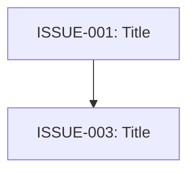

# To Issues

将 PRD、plan、spec 或当前上下文拆成可独立领取的本地 issues。每个 issue 都应该是一条 tracer-bullet vertical slice，能端到端交付一小段完整行为。

## Language Contract

Language Contract: generated documents and chat outputs default to Chinese-first; preserve English for code, commands, API names, contract fields, IDs, proper nouns, and necessary technical terms. 用户或目标项目明确要求英文时可以例外，但必须记录原因。

## 输出约定

- 只生成本地 Markdown 文档，不创建远端 issue。
- 文档正文默认中文为主；核心 section heading 使用中文优先、English 括注，例如 `## 需求覆盖 (Requirement Coverage)`。
- 保留 `ISSUE-001`、`Covers`、`Depends on`、`Unblocks`、`Parallelization`、`Wave` 等 workflow contract fields 和稳定 ID。
- 如果用户指定输出目录，写入该目录。
- 如果源 PRD 位于 `docs/features/<feature-slug>/prd.md`，默认写入 `docs/features/<feature-slug>/issues/`。
- 如果沿用旧结构且用户未指定目录，使用 `docs/issues/<feature-slug>/`。
- 创建 `00-index.md` 汇总 coverage、依赖、执行波次和并行建议。
- 为每个 issue 创建编号文件：`01-<slug>.md`、`02-<slug>.md`。
- issue ID 使用本地稳定编号：`ISSUE-001`、`ISSUE-002`。
- 如果存在 feature manifest，更新 Issues 状态和路径。

## Process

### 1. 收集上下文

优先读取用户给出的 PRD、plan 或 spec。没有明确路径时，从当前上下文和 `docs/features/`、`docs/prd/`、`docs/issues/` 中寻找最相关 artifact。

同时读取与拆分直接相关的项目决策文档：

- 用户指定的来源文档。
- PRD 或 plan 引用的 ADRs、domain docs、接口说明或架构说明。

Issue titles 和 descriptions 应使用项目已有 domain vocabulary，并尊重输入 artifacts 中明确写出的约束和决策。

### 2. 建立 coverage map

从 PRD 中提取：

- `FR-###` functional requirements。
- `SC-###` success criteria。
- user stories。
- testing decisions。

每个 issue 必须声明 `Covers`：

- `FR-001`
- `FR-001, FR-003`
- `Conversation requirement: ...`
- `Bug repro: ...`

不要创建无法追溯来源的 AFK issue。

### 3. 拆成 vertical slices

拆分规则：

- 每个 slice 交付一条狭窄但完整的用户或系统行为路径。
- 完成后的 slice 必须可以单独 demo、verify 或 test。
- 优先拆成多个薄 slices，而不是少数几个厚 slices。
- 避免把纯 setup、纯 schema、纯 UI、纯 cleanup 单独作为 AFK issue，除非它本身就是可验证交付物或明确 blocker。
- 如果某个 slice 需要人类做产品、架构或设计决策，标记为 `HITL`；否则优先标记为 `AFK`。

### 4. 明确依赖关系

依赖类型：

- `hard`: 前置 issue 不完成，本 issue 不能开始。
- `soft`: 可以提前探索或准备，但最终实现/合并需要前置 issue 的结果。
- `human-gate`: 需要用户、designer、maintainer 或 architect 确认。

检查 dependency graph：

- 不允许出现 cycle。
- 每个 dependency 都要写原因。
- 明确 `Depends on` 和 `Unblocks`。

### 5. 给出并行执行指引

为每个 issue 标记 `Parallelization`：

- `parallel-safe`: 同一 wave 内可以并行执行，没有 hard dependency，也没有明显共享写入冲突。
- `coordination-needed`: 可以并行探索或部分实现，但涉及共享 contract、schema、核心 module、设计语言或 migration。
- `sequential`: 不建议并行。
- `human-gate`: 不能作为 AFK subagent 任务直接执行。

同一 wave 内只有 `parallel-safe` issues 可以直接分配给多个 subagents。如果两个 issues 会修改同一个 contract、schema、公共接口或核心 workflow，不要标成无条件并行。

### 6. 先给用户确认拆分

除非用户明确要求直接写文件，否则先展示拟定拆分：

- **ID**
- **Title**
- **Type**: `AFK` / `HITL`
- **Covers**
- **Parallelization**
- **Wave**
- **Depends on**
- **Unblocks**

用户确认后再写文件。若用户要求直接产出，在 `00-index.md` 中标记未确认 assumptions。

### 7. 写入本地 issue 文档

`00-index.md` 模板：

````markdown
# <Feature Name> Issues

## 元数据 (Metadata)

- **Source**: <PRD path / plan path / conversation context>
- **Generated at**: <YYYY-MM-DD>
- **Status**: Draft

## 假设 (Assumptions)

- None

## 需求覆盖 (Requirement Coverage)

| Requirement | Issues | Verification seam | Notes |
| --- | --- | --- | --- |
| FR-001 | ISSUE-001 | ... | ... |

## 依赖图 (Dependency Graph)



## 执行波次 (Execution Waves)

| Wave | Issues | Parallel guidance |
| --- | --- | --- |

## Subagent 执行指引 (Subagent Execution Guidance)

- 推荐并发数或不建议并发的原因。
- 共享 contracts、schemas、modules 或 workflows。
- human-gate。

## Issue 索引 (Issue Index)

| ID | Title | Type | Covers | Parallelization | Wave | Depends on | File |
| --- | --- | --- | --- | --- | --- | --- | --- |
````

Issue 文件模板：

```markdown
# ISSUE-<NNN>: <Title>

## 元数据 (Metadata)

- **Type**: `AFK` / `HITL`
- **Covers**: `FR-001` / `Conversation requirement: ...`
- **Parallelization**: `parallel-safe` / `coordination-needed` / `sequential` / `human-gate`
- **Wave**: <number>
- **Depends on**: `None` or `<ISSUE-ID> (<dependency type>: <reason>)`
- **Unblocks**: `None` or `<ISSUE-ID>`

## 构建内容 (What to build)

简洁描述这个 vertical slice 的端到端行为。

## 验收标准 (Acceptance Criteria)

- [ ] ...

## 测试说明 (Testing Notes)

- Verification seam:
- Prior art:
- Manual fallback:

## 并行执行说明 (Parallel Execution Notes)

- ...

## 实现说明 (Implementation Notes)

- 必要的 module、contract、schema、API 或 workflow 决策。
```

### 8. 验证输出

写入文件后检查：

- 所有 issue 文件都存在，并能从 `00-index.md` 链接到。
- 每个 issue 都有 `Covers`、`Depends on`、`Unblocks`、`Parallelization` 和 `Wave`。
- Requirement coverage table 覆盖所有 PRD `FR-###`，或明确说明未覆盖原因。
- Dependency graph 没有 cycle。
- 没有要求调用远端 tracker、远端标签配置或外部 skill。

最后报告输出目录、issue 数量、coverage gap、execution waves，以及是否建议在 `implement` 前运行 `analyze`。
